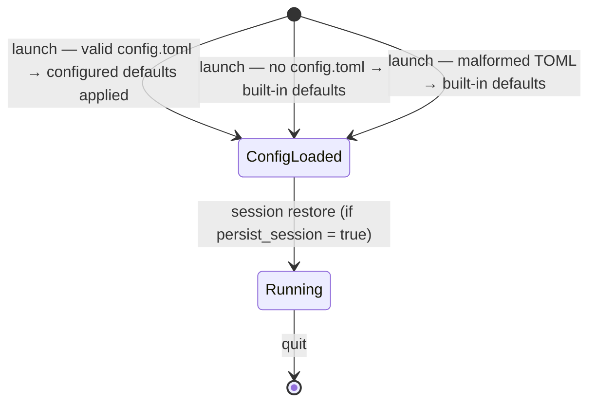

# UseCase: User configures rpncalc defaults via config.toml

## Actor
User (CLI power user)

## Preconditions
- rpncalc is not currently running (config is read at startup only)
- User has write access to `~/.rpncalc/config.toml`

## Main Flow
1. User opens `~/.rpncalc/config.toml` in any text editor
2. User sets one or more values: `angle_mode`, `base`, `precision`,
   `hex_style`, `persist_session`, `max_undo_history`
3. User saves the file and launches rpncalc
4. rpncalc reads the config on startup and applies all valid values
   before rendering the first frame

## Alternate Flows
- **File absent**: rpncalc creates no file and uses all defaults silently
- **Partial config**: only the present keys are applied; absent keys use defaults
- **Invalid field value** (e.g. `angle_mode = "banana"`): that field is
  silently ignored; its default is used; other valid fields still apply

## Error Conditions
- **Entirely malformed TOML**: file cannot be parsed; all defaults used;
  rpncalc launches normally without error

## Postconditions
- rpncalc session starts with the configured defaults active
- ModeBar reflects the configured angle mode and base from the first frame

## Flow

## Acceptance Criteria
**AC-1:** Given a valid `config.toml` at `~/.rpncalc/config.toml`, when rpncalc launches, then the configured defaults are applied before the first frame renders and the ModeBar reflects the configured angle mode and base.

**AC-2:** Given `config.toml` contains an invalid field value, when rpncalc launches, then the invalid field falls back to its default and other valid fields are still applied.

**AC-3:** Given `config.toml` is absent or entirely malformed, when rpncalc launches, then rpncalc starts with all built-in defaults without error.

## Related
- **Configures**: [Session state persists across process restarts](../../state-and-memory/session-persistence/usecase.md)
- **Parent intent**: [Configuration](../../intent.md)

## Implementations <!-- taproot-managed -->
- [Configure Defaults](./tui/impl.md)

## Status
- **State:** specified
- **Created:** 2026-03-21
- **Last reviewed:** 2026-03-24
