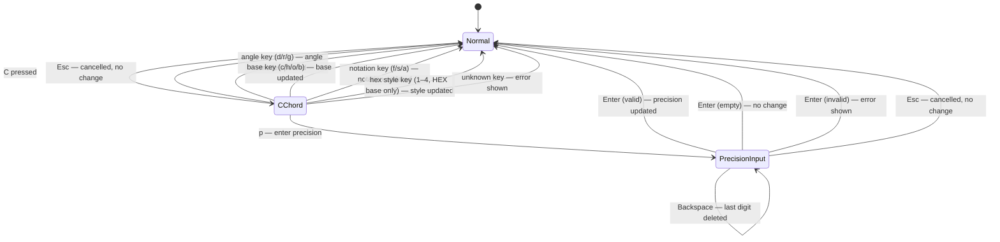

# Behaviour: User configures display and calculation settings via C› chord

## Actor
User (CLI power user)

## Preconditions
- rpncalc is running in Normal mode
- At least one setting differs from the user's desired value (or user is exploring what is configurable)

## Main Flow
1. User presses `C` — rpncalc enters `C›` chord mode; hints pane updates to show all configurable settings grouped by category (angle mode, base, notation, precision, and hex style when base is HEX).
2. User presses one of the setting keys:
   - **Angle mode**: `d` → DEG, `r` → RAD, `g` → GRAD
   - **Base**: `c` → DEC, `h` → HEX, `o` → OCT, `b` → BIN
   - **Notation**: `f` → fixed, `s` → sci, `a` → auto
   - **Precision**: `p` → enters precision-input mode (see Alternate Flow: Precision input)
   - **Hex style** (only shown when base is HEX): `1` → `0xFF`, `2` → `$FF`, `3` → `#FF`, `4` → `FFh`
3. The new setting takes effect immediately: all stack values redisplay, mode bar updates.
4. Chord mode exits; rpncalc returns to Normal mode.
5. Setting persists in the session file and is restored on next launch.

## Alternate Flows

### Precision input (C›p)
- **Trigger:** User presses `p` in `C›` chord mode
- **Steps:**
  1. rpncalc enters `[PREC]` sub-mode; mode bar shows `[PREC]`; input buffer is empty
  2. User types digit keys (`0`–`9`); each digit is appended to the buffer (max 2 characters; further digits ignored)
  3. Non-digit keys other than Enter, Esc, and Backspace are silently ignored
  4. Backspace deletes the last digit from the buffer (no-op if buffer is empty)
  5. User presses `Enter`:
     - If buffer is empty: no change; mode returns to Normal (no error)
     - If parsed value is in range (1–15): precision updates immediately; mode returns to Normal
     - If parsed value is out of range (0, or > 15): error shown on ErrorLine; precision unchanged; mode returns to Normal
  6. User presses `Esc`: input cancelled; precision unchanged; mode returns to Normal
- **Outcome:** Precision updated to the entered value, or unchanged if cancelled or invalid

### Esc at chord level
- **Trigger:** User presses `Esc` after `C` but before a second key
- **Steps:** Chord cancelled; mode returns to Normal; no setting changed
- **Outcome:** No change; hints pane reverts to Normal-mode view

### Hex style key pressed when base ≠ HEX
- **Trigger:** User presses `1`–`4` when the active base is not HEX
- **Steps:** Key is treated as `ChordInvalid`; error shown on ErrorLine; chord exits
- **Outcome:** No change; user sees an "Unknown chord key" message

### Setting unchanged (same value re-selected)
- **Trigger:** User presses the key for the already-active value (e.g. `r` when already in RAD)
- **Steps:** Setting is set to same value; no visible change
- **Outcome:** Idempotent — no error, no display change; chord exits normally

### `C` pressed in Insert or Browse mode
- **Trigger:** User presses `C` while in Insert or Browse mode
- **Steps:** Key is consumed by the active mode (Insert: adds `C` to buffer; Browse: ignored; Alpha: adds `C` to alpha buffer)
- **Outcome:** Config chord does not activate; user must return to Normal mode first

## Postconditions
- Active setting is updated in CalcState
- All stack values immediately redisplay using the new setting
- Mode bar reflects the new angle mode, base, and notation indicator (`SCI` or `AUTO` when non-default; blank when `fixed`)
- Changes are included in the next session save (on quit or SIGTERM)
- `m›`, `x›`, and `X›` chord leaders are no longer available (removed in favour of `C›`); `m` and `x` are Noop in Normal mode

## Error Conditions
- **Precision out of range** (parsed integer is < 1 or > 15): error shown on ErrorLine; precision unchanged; mode returns to Normal. Multi-digit input (e.g. `15`) is accepted and parsed as a whole number.
- **Unknown chord key** (any key not listed in the `C›` submenu): "Unknown chord key" shown on ErrorLine; mode returns to Normal; no setting changed

## Flow

## Related
- `../configure-defaults/usecase.md` — config.toml startup defaults; `C›` overrides them for the running session, which then persists via session file. `notation` will also need a `config.toml` key (values: `fixed`, `sci`, `auto`) alongside the existing `precision` key.
- `../../mathematical-operations/switch-numeric-mode/usecase.md` — **superseded**: `m›`, `x›`, and `X›` from this behaviour move into `C›`; that spec should be updated to reflect the rebinding
- `../../discoverability/execute-chord-operation/usecase.md` — chord execution mechanism used by `C›`
- `../../discoverability/browse-hints-pane/usecase.md` — hints pane must show `C›` submenu with all setting categories

## Acceptance Criteria

**AC-1: Angle mode changes via C› chord**
- Given Normal mode and current angle mode is RAD
- When user presses `C` then `d`
- Then angle mode switches to DEG, mode bar updates to show `DEG`, stack values redisplay

**AC-2: Base changes via C› chord**
- Given Normal mode and current base is DEC
- When user presses `C` then `h`
- Then base switches to HEX, mode bar shows `HEX`, stack values redisplay in hex

**AC-3: Notation switches to scientific**
- Given Normal mode with a float on the stack (e.g. 12345.6789)
- When user presses `C` then `s`
- Then notation mode is `sci` and the stack value redisplays in scientific notation

**AC-4: Notation switches to fixed**
- Given notation mode is `sci`
- When user presses `C` then `f`
- Then notation mode is `fixed` and stack values redisplay in fixed-point

**AC-5: Auto notation displays fixed below threshold**
- Given Normal mode
- When user presses `C` then `a`, and stack contains 12345.6
- Then notation mode is `auto` and 12345.6 displays in fixed-point (below threshold)

**AC-6: Precision input via C›p**
- Given Normal mode with a float on the stack
- When user presses `C`, then `p`, then types `6`, then `Enter`
- Then precision updates to 6 and the float redisplays with 6 decimal places

**AC-7: Precision out of range rejected**
- Given precision input mode (`[PREC]`)
- When user types `0` and presses `Enter`
- Then ErrorLine shows an error; precision is unchanged; mode returns to Normal

**AC-8: Hex style only available when base is HEX**
- Given base is DEC
- When user presses `C` then `1`
- Then an error is shown; hex style is unchanged

**AC-9: Hex style changes when base is HEX**
- Given base is HEX
- When user presses `C` then `2`
- Then hex style switches to `$FF` and stack values redisplay

**AC-10: Esc cancels chord with no change**
- Given Normal mode
- When user presses `C` then `Esc`
- Then mode returns to Normal; no setting changed

**AC-11: Settings persist across restart**
- Given user sets notation to `sci` and precision to `6` via `C›`
- When user quits and relaunches rpncalc
- Then notation is `sci` and precision is `6` from the first frame

**AC-12: m and x are Noop in Normal mode**
- Given Normal mode (after `m›` and `x›` are removed)
- When user presses `m` or `x`
- Then both keys are Noop; no chord mode is entered; no error shown

**AC-13: C› hints pane shows all setting categories**
- Given `C›` chord is active
- When hints pane renders
- Then all categories (ANGLE, BASE, NOTATION, PRECISION, and HEX STYLE if base=HEX) are visible

**AC-14: Mode bar shows notation indicator after change**
- Given Normal mode and notation is `fixed`
- When user presses `C` then `s`
- Then mode bar shows `SCI` alongside angle mode and base indicators
- And when user subsequently presses `C` then `a`, mode bar shows `AUTO`
- And when user subsequently presses `C` then `f`, no notation indicator is shown (fixed is default/silent)

**AC-15: Auto notation displays sci above threshold**
- Given notation mode is `auto`
- When stack contains 1.23456e12 (above threshold)
- Then 1.23456e12 displays in scientific notation

## Implementations <!-- taproot-managed -->
- [tui](./tui/impl.md)

## Status
- **State:** specified
- **Created:** 2026-03-25
- **Last reviewed:** 2026-03-25

## Notes
- **Notation threshold for `auto` mode**: sci notation activates when `|value| ≥ 1e10` or `(|value| < 1e-4 and value ≠ 0)`. To be confirmed during implementation.
- **Precision range**: 1–15 digits. Default 15. Mirrors the existing `precision` config.toml field.
- **Mode bar notation indicator**: when notation is `fixed` (the default), no extra indicator is shown. When `sci` or `auto`, a short label (`SCI` or `AUTO`) appears in the mode bar alongside `DEG  DEC`. The label is omitted when it would overlap the mode indicator or settings (same truncation rule as the last-command label).
- **`m›`, `x›`, and `X›` removal**: `m`, `x`, and `X` in Normal mode become Noop after this behaviour is implemented. They may be repurposed in future; that decision is out of scope here.
- **Precision input UX**: behaves like a mini Insert mode — up to 2 digits accumulate, `Enter` confirms, `Esc` cancels, `Backspace` deletes the last digit. Non-digit keypresses (other than Enter, Esc, Backspace) are silently ignored. The mode bar shows `[PREC]` to indicate the sub-mode. Empty-buffer `Enter` is a no-op (not an error).
- **CalcState and session file schema**: `notation` is a new field on `CalcState` (not currently present). Implementing this behaviour requires: (1) adding `notation: Notation` to `CalcState`, (2) extending session serialization/deserialization to include `notation`, (3) adding a `notation` key to `config.toml` parsing (values: `"fixed"`, `"sci"`, `"auto"`; default: `"fixed"`). `precision` is already in `CalcState` and config.toml.
- **Auto notation and integers**: `auto` (and `sci`) notation modes do not affect integer display. Integers always display in the active base without decimal or scientific notation, regardless of magnitude.
