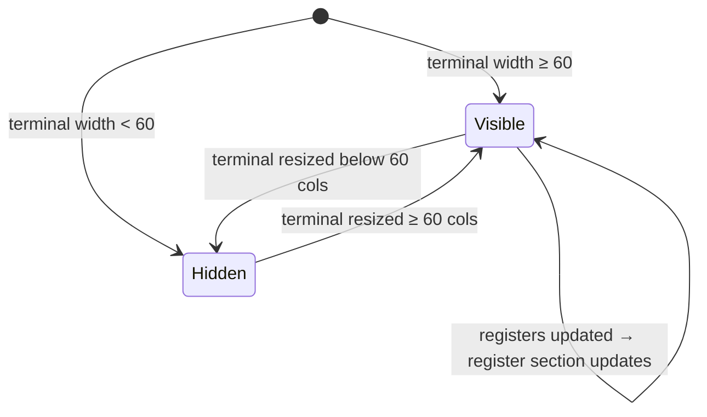

# UseCase: User browses the hints pane to find an operation

## Actor
User (CLI power user)

## Preconditions
- rpncalc is running with terminal width ≥60 columns (hints pane visible)

## Main Flow
1. User glances at the hints pane — no explicit action required
2. Pane displays a categorised grid of available operations and their keys,
   filtered to the current stack depth:
   - Empty stack: push hints and constants
   - 1 item: adds unary operation hints
   - 2+ items: highlights binary operation hints
3. User identifies the key (or chord) for the desired operation and presses it

## Alternate Flows
- **Registers exist**: a register section appears at the bottom of the pane
  showing defined register names and their `RCL` commands
- **Terminal width 60–79 cols**: hints pane narrows; labels may abbreviate
- **Terminal width <60 cols**: hints pane collapses entirely; user must know
  keybindings from memory

## Error Conditions
- None — hints pane is read-only and purely functional

## Postconditions
- User has identified and executed the desired operation
- Hints pane updates immediately to reflect the new stack state

## Flow

## Acceptance Criteria
**AC-1:** Given terminal width ≥60 columns and an empty stack, when the hints pane renders, then push hints and constants are shown.

**AC-2:** Given terminal width ≥60 columns and stack depth ≥2, when the hints pane renders, then binary operation hints are highlighted.

**AC-3:** Given named registers exist, when the hints pane renders, then a register section appears showing each register name and its RCL command.

**AC-4:** Given terminal width <60 columns, then the hints pane collapses entirely and no hints are shown.

## Related
- **Sibling**: [User executes an operation via chord sequence](../execute-chord-operation/usecase.md)
- **Parent intent**: [Discoverability](../../intent.md)

## Implementations <!-- taproot-managed -->
- [Browse Hints Pane](./tui/impl.md)

## Status
- **State:** specified
- **Created:** 2026-03-21
- **Last reviewed:** 2026-03-24
