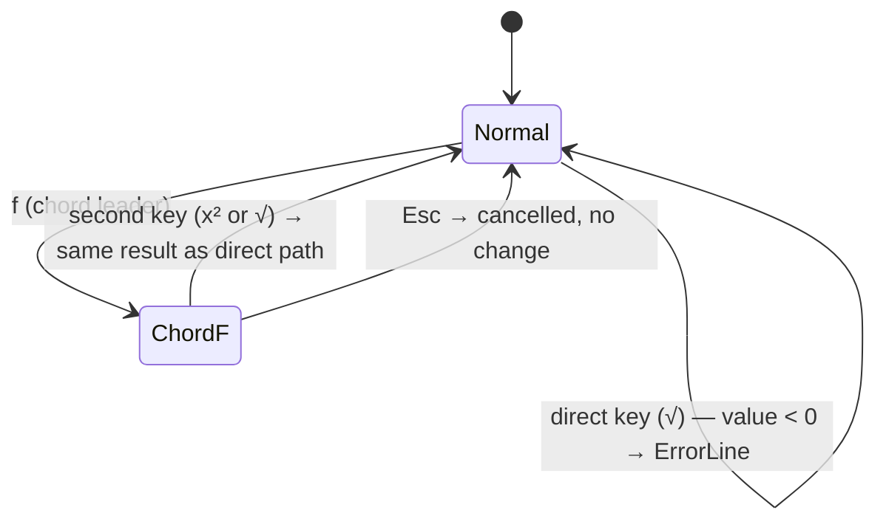

# Behaviour: User applies x² and √ directly without a chord prefix

## Actor
User (CLI power user)

## Preconditions
- rpnpad is running in Normal mode
- Stack has ≥1 item (both operations are unary)

## Main Flow
1. User presses the direct key for x² or √ (single keypress, no chord prefix)
2. Operation executes immediately; result replaces position 1
3. Hints pane shows x² and √ alongside other immediate Normal-mode operations

## Alternate Flows
### Via f› chord (backward-compatible path)
- **Trigger:** User presses `f` then the second key for x² or √
- **Steps:**
  1. Chord flow executes as per `execute-chord-operation`
  2. Same result as the direct key path
- **Outcome:** Operation executes; both paths are equivalent and always available

### Other f› operations remain chord-only
- **Trigger:** User wants reciprocal (1/x) or absolute value (|x|)
- **Steps:**
  1. User presses `f›` chord leader then second key
- **Outcome:** Operation executes via chord; no direct key exists for these operations

## Postconditions
- Result of x² or √ is at position 1; stack depth unchanged
- Hints pane updates to reflect new stack state
- The `f›` chord submenu still works for all four function operations

## Error Conditions
- **Stack empty when direct key pressed**: error shown on ErrorLine, stack unchanged (identical to all other unary operations)
- **√ of a negative number**: domain error shown on ErrorLine, stack unchanged; no partial state written

## Flow

## Related
- `../execute-chord-operation/usecase.md` — chord path remains fully functional; this behaviour adds a direct alternative, not a replacement
- `../browse-hints-pane/usecase.md` — hints pane must be updated to surface x² and √ in Normal-mode view; this is the discoverability payoff of this behaviour
- `../../mathematical-operations/apply-operation/usecase.md` — defines the engine contract for unary operations; x² and √ already exist in the engine, only the trigger path changes

## Acceptance Criteria

**AC-1: Direct key squares position 1**
- Given Normal mode and stack depth ≥1
- When the user presses the direct x² key
- Then position 1 is replaced by its square and the hints pane updates

**AC-2: Direct key takes square root of position 1**
- Given Normal mode, stack depth ≥1, and position 1 is a non-negative number
- When the user presses the direct √ key
- Then position 1 is replaced by its square root and the hints pane updates

**AC-3: x² and √ appear in Normal-mode hints pane**
- Given Normal mode with stack depth ≥1 and terminal width ≥60 columns
- When the hints pane renders
- Then x² and √ are shown directly in the Normal-mode view (not hidden behind the f› chord group)

**AC-4: f› chord path continues to work for x² and √**
- Given Normal mode
- When the user presses `f` then the second key for x² or √
- Then the operation executes identically to the direct key path

**AC-5: Reciprocal and abs remain chord-only**
- Given Normal mode
- When the hints pane renders in Normal mode
- Then reciprocal (1/x) and absolute value (|x|) are not shown as direct-key operations; they remain accessible only via `f›`

**AC-6: Direct key on empty stack shows error**
- Given Normal mode and an empty stack
- When the user presses the direct x² or √ key
- Then an error is shown on ErrorLine and the stack is unchanged

**AC-7: √ of negative number shows domain error**
- Given Normal mode and position 1 is a negative number
- When the user presses the direct √ key
- Then a domain error is shown on ErrorLine and the stack is unchanged

## Implementations <!-- taproot-managed -->
- [TUI](./tui/impl.md)

## Status
- **State:** implemented
- **Created:** 2026-03-25
- **Last reviewed:** 2026-03-26

## Notes
- **Key binding resolution:** `q` was rebound to x² and quit moved to `Q` (shift-Q — keeps single-key quit without a ctrl modifier). `w` was assigned to √ (`s` remains swap; `\` was rejected as awkward to type on most keyboards).
- The `f›` chord label `fn` is opaque and contributed to the discoverability problem. Consider renaming it to `f›  √x²` or similar in the chord submenu header as a low-cost companion fix.
- x² and √ are the two highest-frequency functions in the `f›` group; reciprocal and abs are deliberately left chord-only to avoid over-populating the Normal-mode direct key space.
