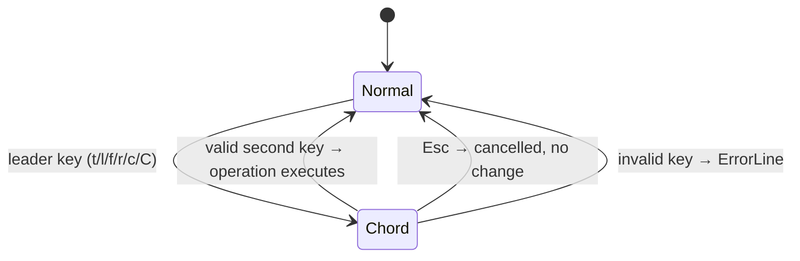

# UseCase: User executes an operation via chord sequence

## Actor
User (CLI power user)

## Preconditions
- rpnpad is running in normal mode

## Main Flow
1. User presses a chord leader key: `t` (trig), `l` (log/exp), `f` (functions),
   `r` (round), `c` (constants), `C` (config)
2. Calculator enters chord-wait state; hints pane switches to submenu view
   showing the category header and available second keys
3. User presses the second key to execute the target operation
4. Operation executes; hints pane returns to normal categorised view

## Alternate Flows
- **Esc mid-chord**: chord cancelled, returns to normal mode with no operation
  executed and no state change

## Error Conditions
- **Unrecognised second key**: chord is cancelled, error shown on ErrorLine,
  state unchanged

## Postconditions
- Target operation has executed (with its own postconditions)
- Input mode is back to normal
- Hints pane reflects updated stack state

## Flow

## Acceptance Criteria
**AC-1:** Given normal mode, when the user presses a chord leader key, then chord-wait state is entered and the hints pane switches to the chord submenu.

**AC-2:** Given chord-wait state, when the user presses a valid second key, then the target operation executes and mode returns to normal.

**AC-3:** Given chord-wait state, when Esc is pressed, then the chord is cancelled, mode returns to normal, and no state change occurs.

**AC-4:** Given chord-wait state, when an unrecognised key is pressed, then the chord is cancelled and an error is shown on the ErrorLine.

## Related
- **Sibling**: [User browses the hints pane to find an operation](../browse-hints-pane/usecase.md)
- **Parent intent**: [Discoverability](../../intent.md)
- **Executes**: [User applies a mathematical operation to stacked values](../../mathematical-operations/apply-operation/usecase.md)

## Implementations <!-- taproot-managed -->
- [Execute Chord Operation](./tui/impl.md)

## Status
- **State:** implemented
- **Created:** 2026-03-21
- **Last reviewed:** 2026-03-26
