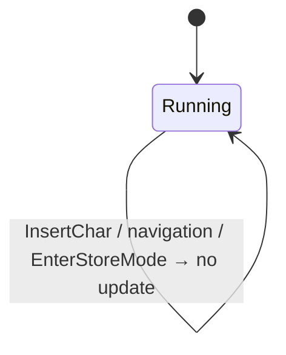

# Behaviour: User sees the last executed keypress and operation in the mode bar

## Actor
User (CLI power user)

## Preconditions
- rpnpad is running in any mode
- At least one operation has been executed since the session started

## Main Flow
1. User presses a key (or chord sequence) that executes an operation.
2. The operation executes (success or failure).
3. The mode bar updates to show the key(s) pressed and the operation name in the centre: e.g. `+ → add`, `rf → floor`, `q → x²`, `↵ → dup`, `Q → quit`.
4. The display persists unchanged until the next operation is executed.

## Alternate Flows
### Chord sequence
- **Trigger:** User presses a chord leader then a second key (e.g. `r` then `f`)
- **Steps:**
  1. Chord executes normally
  2. Mode bar shows both keys concatenated: `rf → floor`
- **Outcome:** Full two-key sequence visible; user sees exactly what chord they pressed

### Failed operation (stack underflow or domain error)
- **Trigger:** User presses a key but the operation fails (e.g. `+` on an empty stack)
- **Steps:**
  1. Error is shown on ErrorLine; stack unchanged
  2. Mode bar still updates to show the attempted operation: `+ → add`
- **Outcome:** User can see what key caused the error, even when the operation did not complete

### Undo / Redo
- **Trigger:** User presses `u` (undo) or `ctrl-r` (redo)
- **Steps:**
  1. Undo/redo executes
  2. Mode bar shows: `u → undo` or `^r → redo`
- **Outcome:** Undo/redo actions visible in mode bar alongside arithmetic operations

### Yank (clipboard copy)
- **Trigger:** User presses `y`
- **Steps:**
  1. Top-of-stack value is copied to clipboard
  2. Mode bar shows: `y → copy`
- **Outcome:** User gets confirmation that the copy action fired

### Mode-change chord
- **Trigger:** User executes a mode-change chord via `C›` (e.g. `C` then `d` for DEG, `C` then `h` for HEX)
- **Steps:**
  1. Angle mode or base changes
  2. Mode bar shows the chord and the new mode name: `Cd → deg`, `Ch → hex`
- **Outcome:** User sees which chord triggered the mode change; mode indicator on the right also updates

### Session start (no prior operation)
- **Trigger:** rpnpad just launched; no key has been pressed yet
- **Steps:** Mode bar shows no last-command indicator — centre is blank
- **Outcome:** Mode bar looks identical to current behaviour until first operation

### Insert mode submit-then-operate
- **Trigger:** User types a number then presses an op key in Insert mode (e.g. `3` then `+`)
- **Steps:**
  1. Buffer is pushed onto stack
  2. Operation executes
  3. Mode bar shows the op key: `+ → add`
- **Outcome:** Operation key shown; the buffer push is implicit and not labelled separately

## Postconditions
- Mode bar centre shows `<keys> → <op-name>` for the most recently executed operation
- Display persists until replaced by the next operation
- Last-command label is unchanged while a chord is in progress (leader key pressed, second key not yet pressed)
- Mode indicator (left) and settings (right: angle, base) are unaffected

## Error Conditions
- **Mode bar too narrow to show last command**: If the last-command label would overlap the mode indicator or settings, the label is omitted entirely — no partial display. Mode and settings always take priority.

## Flow

## Related
- `../browse-hints-pane/usecase.md` — hints pane shows what keys *will* do; this behaviour shows what a key *just did* — complementary feedback loop
- `../../presentation/polish-visual-style/usecase.md` — mode bar layout; last-command label occupies the currently-unused centre space
- `../execute-chord-operation/usecase.md` — chord sequences produce two-key labels (`rf`, `ts`, etc.)

## Acceptance Criteria

**AC-1: Single-key operation appears in mode bar centre**
- Given Normal mode and stack depth ≥ 2
- When the user presses `+`
- Then the mode bar centre shows `+ → add`

**AC-2: Chord sequence shows both keys**
- Given Normal mode and stack depth ≥ 1
- When the user presses `r` then `f` (floor chord)
- Then the mode bar centre shows `rf → floor`

**AC-3: Failed operation still updates the label**
- Given Normal mode and an empty stack
- When the user presses `+`
- Then the mode bar centre shows `+ → add` (even though an error appeared on ErrorLine)

**AC-4: Label persists until next operation**
- Given the mode bar shows `+ → add`
- When the user navigates (arrow keys, chord leader entry) without executing an operation
- Then the mode bar still shows `+ → add`

**AC-5: Undo shown in mode bar**
- Given at least one undoable action exists
- When the user presses `u`
- Then the mode bar centre shows `u → undo`

**AC-6: Session start shows blank centre**
- Given rpnpad has just launched and no key has been pressed
- When the mode bar renders
- Then the centre is blank (no last-command label)

**AC-7: Insert submit-then-operate shows op key**
- Given Insert mode with `3` in the buffer and stack depth ≥ 1
- When the user presses `+`
- Then the mode bar centre shows `+ → add`

**AC-8: Mode indicator and settings not displaced**
- Given any last-command label is showing
- When the mode bar renders
- Then `[NORMAL]` (or current mode) appears on the left and `DEG  DEC` (or current settings) appears on the right, unchanged

**AC-9: Yank updates the label**
- Given Normal mode and stack depth ≥ 1
- When the user presses `y`
- Then the mode bar centre shows `y → copy`

**AC-10: Mode-change chord updates the label**
- Given Normal mode
- When the user presses `C` then `d` (angle mode → DEG via `C›` chord)
- Then the mode bar centre shows `Cd → deg`

**AC-11: EnterStoreMode does not update the label**
- Given the mode bar centre shows `+ → add`
- When the user presses `S` (entering store-name mode)
- Then the mode bar centre still shows `+ → add` (unchanged)

## Implementations <!-- taproot-managed -->
- [tui](./tui/impl.md)

## Status
- **State:** implemented
- **Created:** 2026-03-25
- **Last reviewed:** 2026-03-26

## Notes
- **Operations that update the label:** all `Execute(Op)`, `Undo`, `Redo`, `Yank`, mode-change chords (`SetAngleMode`, `SetBase`, `SetHexStyle`), and `Enter` in Normal mode (→ Dup). This is the complete set.
- **Operations that do NOT update the label:** `EnterStoreMode` (`S`, enters a sub-mode), chord leader entry alone (transient), `InsertChar`, navigation keys (`↑`/`↓`/`Enter` in Browse), `AlphaSubmit`, `AlphaCancel`.
- **Chord entry in progress:** while a chord leader has been pressed but the second key has not yet been received, the label is unchanged. The label updates only when the chord completes (second key pressed).
- **Op-name format:** use the English text label from the hints pane — `add`, `floor`, `deg`, `undo`, `copy`, `x²`. Do not use Unicode symbols (`⌊x⌋`, `√`) or operator characters (`+`).
- **Key format for ctrl:** `^` prefix — e.g. `^r → redo`. Ctrl is the only modifier shown; shift is implicit in the key character (`Q`, `R`, `S` are already uppercase).
- **Label format:** `<keys> → <op-name>`. The arrow `→` matches the visual language used throughout the hints pane.
- `Enter` in Normal mode maps to `Dup` — shown as `↵ → dup`.
