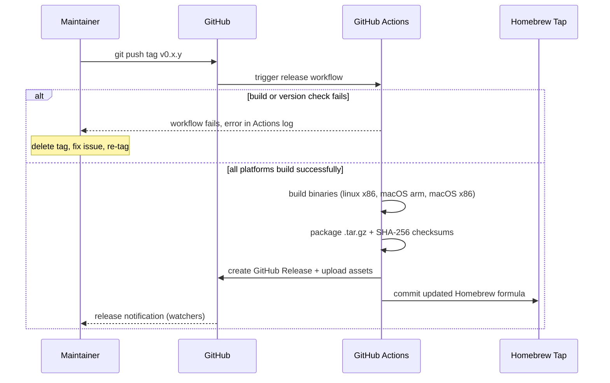

# Behaviour: Maintainer publishes a release via cargo-dist

## Actor
Maintainer (solo developer)

## Preconditions
- `.github/workflows/release.yml` exists and is committed (generated once by `cargo dist init`)
- `Cargo.toml` contains `[workspace.metadata.dist]` with target platforms configured
- The Homebrew tap repository exists (e.g. `<owner>/homebrew-tap`) and the maintainer has push access (if Homebrew publishing is enabled)
- The version in `Cargo.toml` has been bumped to match the intended tag

## Main Flow
1. Maintainer pushes a git tag matching the release pattern (e.g. `v0.2.0`) to GitHub.
2. GitHub Actions detects the tag and triggers the cargo-dist release workflow.
3. The workflow validates that the tag version matches `Cargo.toml`; if not, it fails immediately.
4. The workflow builds native binaries for each target platform (x86\_64-unknown-linux-gnu, aarch64-apple-darwin, x86\_64-apple-darwin).
5. The workflow packages each binary as a `.tar.gz` archive and computes SHA-256 checksums.
6. The workflow creates a GitHub Release, uploads the archives, checksums, and installer script as release assets, and publishes the release.
7. The workflow commits an updated Homebrew formula to the tap repository, referencing the new version's archive URL and checksum.
8. GitHub notifies repository watchers that a new release has been published.
9. Maintainer verifies the release page shows the expected assets and the Homebrew formula is updated.

## Alternate Flows
### Skip Homebrew tap (first release, tap not yet configured)
- **Trigger:** `[workspace.metadata.dist]` has no Homebrew tap configured
- **Steps:**
  1. Workflow builds binaries and creates the GitHub Release as normal.
  2. Workflow skips the Homebrew formula commit step.
- **Outcome:** Release assets and installer script are published; Homebrew tap is not updated. Maintainer configures the tap for subsequent releases.

### Workflow build failure
- **Trigger:** A compiler error or test failure occurs during the CI build
- **Steps:**
  1. The failing job reports an error in the GitHub Actions log.
  2. A draft GitHub Release may have been created before the failure; the maintainer should delete it before re-tagging.
  3. The git tag remains; the maintainer deletes it, fixes the underlying issue, and re-tags.
- **Outcome:** No published release; the failure is visible in the Actions tab.

## Postconditions
- A GitHub Release exists at the expected tag with binary archives and SHA-256 checksums for all target platforms
- A Homebrew formula in the tap repository references the new version, archive URL, and checksum
- An `install.sh` installer script in the release assets installs the correct binary for the user's platform
- GitHub has notified repository watchers that a new release has been published
- `cargo install rpncalc` continues to resolve to the new version once published to crates.io (if crates.io publishing is enabled)

## Error Conditions
- **Tag version does not match `Cargo.toml` version**: cargo-dist validates the tag against the workspace version and fails the workflow before any release is created; maintainer must delete the tag, bump the version, and re-tag.
- **Homebrew tap push rejected (permissions error)**: The release assets are published but the formula is not updated; the workflow exits with a non-zero status and the error is visible in the Actions log. Maintainer must update the formula manually or fix tap credentials.
- **Binary build fails for one platform (cross-compilation toolchain missing)**: The failing job fails the workflow; no release is published. cargo-dist uses fail-fast semantics — all platforms must succeed for a release to be created. Maintainer fixes the toolchain and re-tags.

## Flow

## Related
- `../install-via-homebrew/usecase.md` — downstream; this behaviour produces the Homebrew formula that flow consumes
- `../install-via-curl/usecase.md` — downstream; this behaviour produces the install.sh that flow consumes

## Acceptance Criteria

**AC-1: Tag triggers full release pipeline**
- Given cargo-dist is initialised, the workflow is committed, and the Homebrew tap is configured
- When the maintainer pushes a semver tag matching the Cargo.toml version to GitHub
- Then a GitHub Release is created at the tag and release assets are published — all without manual intervention beyond pushing the tag

**AC-2: GitHub Release contains expected assets**
- Given the release workflow completes successfully
- When the maintainer views the GitHub Release page
- Then it contains `.tar.gz` archives for x86\_64-linux, aarch64-macOS, and x86\_64-macOS, SHA-256 checksum files, and an `install.sh` installer script

**AC-3: Homebrew formula is updated**
- Given the release workflow completes and the tap is configured
- When the maintainer inspects the Homebrew tap repository
- Then the formula references the new version's archive URL and correct SHA-256 checksum

**AC-4: Workflow build failure blocks release**
- Given a compiler error exists in the codebase
- When the maintainer pushes a release tag
- Then the GitHub Actions job fails with an error, no GitHub Release is published, and the failure is visible in the Actions tab

**AC-5: First release without Homebrew tap configured**
- Given `[workspace.metadata.dist]` has no Homebrew tap configured
- When the maintainer pushes a release tag
- Then the workflow builds binaries, creates the GitHub Release with archives and installer script, and skips the Homebrew formula step without failing

**AC-6: Version mismatch blocks release**
- Given the git tag (e.g. `v0.3.0`) does not match the version in `Cargo.toml`
- When the maintainer pushes the tag
- Then cargo-dist fails the workflow before creating any release, and the error is visible in the Actions log

## Implementations <!-- taproot-managed -->
- [cargo-dist GitHub Actions Release Pipeline](./github-actions/impl.md)

## Status
- **State:** specified
- **Created:** 2026-03-24
- **Last reviewed:** 2026-03-24

## Notes
- `cargo dist init` is a one-time setup step run locally; it writes `[workspace.metadata.dist]` to `Cargo.toml` and generates `.github/workflows/release.yml`. This spec covers the repeatable release act, not the one-time setup.
- crates.io publishing is optional; cargo-dist can be configured to publish or skip it.
- The `install.sh` installer script is generated by `cargo dist init` and uploaded as a static asset each release — it is not regenerated per release.
- cargo-dist can auto-generate release notes from a `CHANGELOG.md` if one exists and is kept up to date. Whether to maintain a changelog is a separate decision; without it, the release notes will be empty or auto-generated from git log.
- Archives and checksums are produced; binaries are not code-signed (no certificate infrastructure required).
