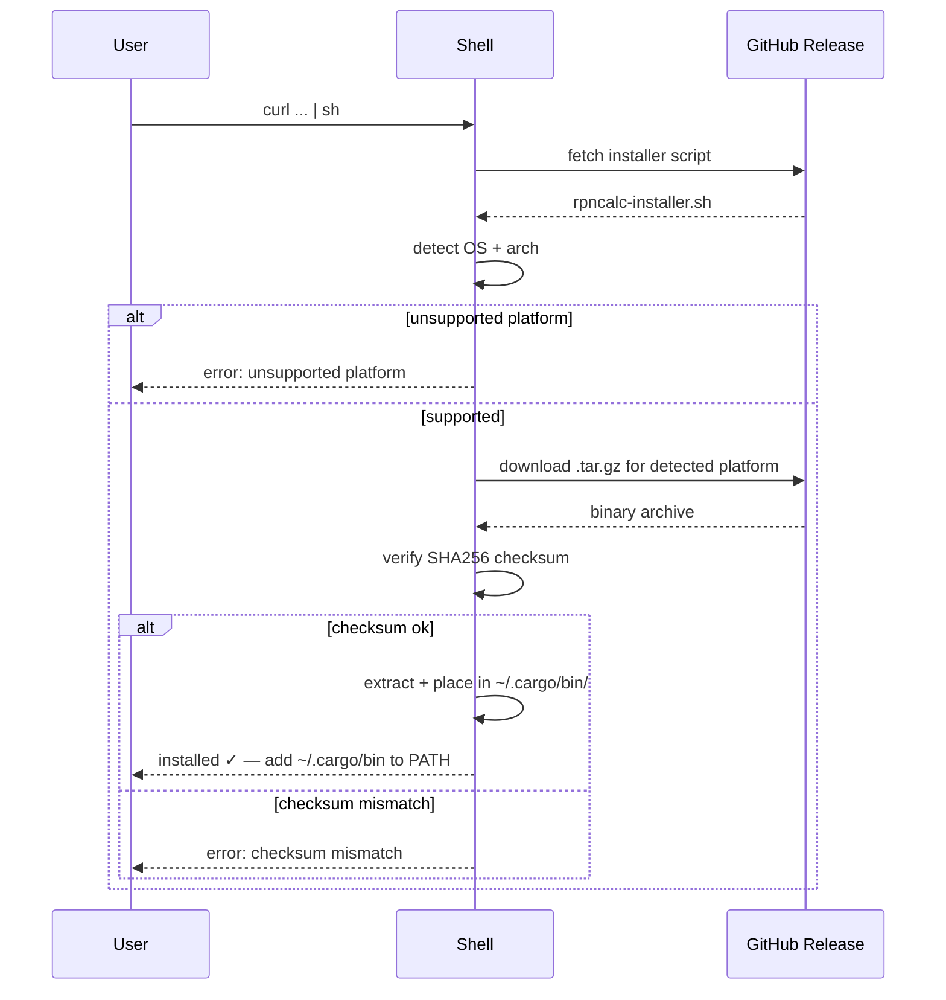

# Behaviour: User installs rpncalc via curl installer

## Actor
CLI power user (Linux or macOS)

## Preconditions
- `curl` is available on the user's system
- The user's platform is one of: x86\_64 Linux, aarch64 macOS, x86\_64 macOS
- A GitHub Release exists with a published installer script and binary archives
- The user has internet access

## Main Flow
1. User copies the install command from the project README or release page.
2. User runs `curl --proto '=https' --tlsv1.2 -LsSf https://github.com/OWNER/rpncalc/releases/latest/download/rpncalc-installer.sh | sh`.
3. The installer script detects the user's OS and CPU architecture.
4. The installer downloads the appropriate `.tar.gz` archive from the GitHub Release.
5. The installer verifies the archive's SHA-256 checksum.
6. The installer extracts the binary and places it in `~/.cargo/bin/` (created if absent).
7. The installer prints a success message, noting that `~/.cargo/bin/` must be on PATH.
8. User adds `~/.cargo/bin/` to their `$PATH` if not already present (or starts a new shell if their profile already sources it).
9. User runs `rpncalc` and the calculator starts.

## Alternate Flows
### PATH already contains `~/.cargo/bin/`
- **Trigger:** User's shell profile already adds `~/.cargo/bin/` to PATH (common for Rust users)
- **Steps:**
  1. Installation completes as normal.
  2. User runs `rpncalc` immediately without any PATH adjustment.
- **Outcome:** Zero friction; calculator is available in the current shell.

### Install to custom directory
- **Trigger:** User pipes the script but sets `CARGO_HOME` or equivalent env var
- **Steps:**
  1. Installer respects the env var and places the binary in the specified location.
- **Outcome:** Binary installed to user-specified path; user is responsible for PATH.

## Postconditions
- The rpncalc binary is present at `~/.cargo/bin/rpncalc` (or custom location)
- Once `~/.cargo/bin/` is on PATH, `rpncalc` launches the calculator
- No system-level permissions were required (user-space install)
- No Rust toolchain was installed

## Error Conditions
- **Unsupported platform detected**: The installer script prints an error naming the detected OS/arch and exits without installing; user must build from source with `cargo install rpncalc`.
- **Network error downloading archive**: `curl` exits non-zero; user checks connectivity and re-runs the command.
- **Checksum mismatch on downloaded archive**: Installer aborts and prints a checksum error; user re-runs to re-download (transient corruption) or reports to maintainer (possible release issue).
- **`~/.cargo/bin/` not on PATH after install**: The calculator is installed but not reachable until the user updates their shell profile; the installer prints an explicit reminder with the required export line.
- **`curl` not available**: Command not found; user installs curl via their system package manager (`apt install curl`, `brew install curl`, etc.) and retries.

## Flow

## Related
- `../cargo-dist-release-pipeline/usecase.md` — upstream; produces the installer script and binary archives this flow consumes
- `../install-via-homebrew/usecase.md` — sibling; alternative install path for macOS users who prefer Homebrew

## Acceptance Criteria

**AC-1: Install completes and binary is present**
- Given the user is on a supported platform with curl and internet access
- When the user runs the install command from the README
- Then the rpncalc binary is placed at `~/.cargo/bin/rpncalc` without requiring sudo or a Rust toolchain

**AC-2: Correct platform binary installed**
- Given the user is on x86\_64 Linux
- When the installer script runs
- Then the x86\_64-unknown-linux-gnu binary is downloaded and installed (not a macOS binary)

**AC-3: Unsupported platform gives actionable error**
- Given the user is on a platform not in the target list (e.g. Windows, ARM Linux)
- When the installer script runs
- Then it exits with an error naming the detected platform and suggests `cargo install rpncalc` as an alternative

**AC-4: Checksum mismatch aborts installation**
- Given the downloaded archive does not match the expected SHA-256
- When the installer verifies the checksum
- Then it aborts without placing any binary and prints a checksum error

**AC-5: PATH reminder shown when needed**
- Given `~/.cargo/bin/` is not already on the user's PATH
- When installation succeeds
- Then the installer prints the export line the user needs to add to their shell profile

## Implementations <!-- taproot-managed -->
- [cargo-dist installer + README](./cargo-dist/impl.md)

## Status
- **State:** implemented
- **Created:** 2026-03-24
- **Last reviewed:** 2026-03-24

## Notes
- The installer script is generated by cargo-dist and uploaded as a release asset — it is not hand-maintained.
- `OWNER` is a placeholder for the real GitHub username; the README install command must be updated before the first release.
- The install destination (`~/.cargo/bin/`) is the cargo-dist default; it is user-space and requires no elevated permissions.
- For users who already have Rust installed, `cargo install rpncalc` is a valid alternative (once crates.io publishing is enabled).
