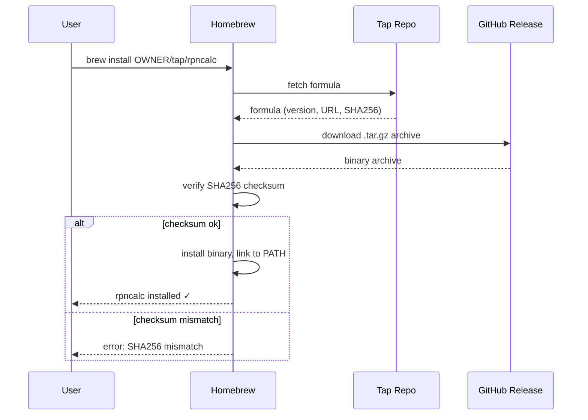

# Behaviour: User installs rpncalc via Homebrew

## Actor
CLI power user (macOS)

## Preconditions
- Homebrew is installed on the user's macOS system
- A GitHub Release exists with a published Homebrew formula (produced by the release pipeline)
- The user has internet access

## Main Flow
1. User runs `brew install OWNER/tap/rpncalc` (or `brew tap OWNER/tap` followed by `brew install rpncalc`).
2. Homebrew downloads and parses the formula from the tap repository.
3. Homebrew downloads the pre-built `.tar.gz` archive for the user's platform (aarch64 or x86\_64 macOS) from the GitHub Release.
4. Homebrew verifies the archive's SHA-256 checksum against the formula.
5. Homebrew installs the binary to the Homebrew prefix and links it onto PATH.
6. User runs `rpncalc` and the calculator starts.

## Alternate Flows
### Tap already registered
- **Trigger:** User has previously run `brew tap OWNER/tap`
- **Steps:**
  1. User runs `brew install rpncalc` (no tap prefix needed).
  2. Flow continues from step 2 of Main Flow.
- **Outcome:** Same as main flow; shorter command.

### Upgrading an existing installation
- **Trigger:** User has a previous version installed and wants to upgrade
- **Steps:**
  1. User runs `brew upgrade rpncalc`.
  2. Homebrew checks the formula for a newer version.
  3. Homebrew downloads and installs the new archive.
- **Outcome:** New version is on PATH; old version removed.

## Postconditions
- `rpncalc` is available on the user's PATH
- `rpncalc --version` (if implemented) reports the installed version
- Homebrew tracks the installation; `brew list` includes rpncalc
- Future `brew upgrade` will update rpncalc when new releases are published

## Error Conditions
- **Tap not found (formula repository does not exist or is private)**: Homebrew reports "Error: Unknown tap: OWNER/tap"; user must wait for tap to be created or use the curl installer instead.
- **Checksum mismatch**: Homebrew aborts installation with "SHA256 mismatch"; indicates a corrupt download or tampered archive. User retries or reports to maintainer.
- **Unsupported platform (Linux)**: Homebrew on Linux (Linuxbrew) may not have a formula; user should use the curl installer instead.
- **Network error during download**: Homebrew reports a download error; user checks connectivity and retries.

## Flow

## Related
- `../cargo-dist-release-pipeline/usecase.md` — upstream; produces the Homebrew formula and binary archives this flow consumes
- `../install-via-curl/usecase.md` — sibling; alternative install path for Linux users or users who prefer not to use Homebrew

## Acceptance Criteria

**AC-1: Fresh install places rpncalc on PATH**
- Given Homebrew is installed and the tap is registered
- When the user runs `brew install OWNER/tap/rpncalc`
- Then Homebrew installs the correct binary for the user's macOS platform and `rpncalc` is available on PATH without a shell restart

**AC-2: Correct platform binary installed**
- Given the user is on Apple Silicon (aarch64)
- When the user installs via Homebrew
- Then the aarch64-apple-darwin binary is installed (not the x86\_64 binary)

**AC-3: Upgrade installs new version**
- Given rpncalc is already installed via Homebrew and a newer release exists
- When the user runs `brew upgrade rpncalc`
- Then the new version is installed and the old version is removed

**AC-4: Tap not found gives actionable error**
- Given the tap repository does not exist
- When the user runs `brew install OWNER/tap/rpncalc`
- Then Homebrew reports a clear error identifying the tap as unknown, and the user is not left with a broken installation

**AC-5: Checksum mismatch aborts installation**
- Given the downloaded archive does not match the formula's SHA-256
- When Homebrew verifies the checksum
- Then Homebrew aborts installation and reports a checksum error; no binary is placed on PATH

## Status
- **State:** specified
- **Created:** 2026-03-24
- **Last reviewed:** 2026-03-24

## Notes
- The formula is auto-generated by the cargo-dist release pipeline; the maintainer does not write it by hand.
- `OWNER` is a placeholder for the real GitHub username; update once the tap repository is created.
- Homebrew on Linux (Linuxbrew) is technically supported but is not the recommended path for Linux users — the curl installer is simpler and more reliable on Linux.
