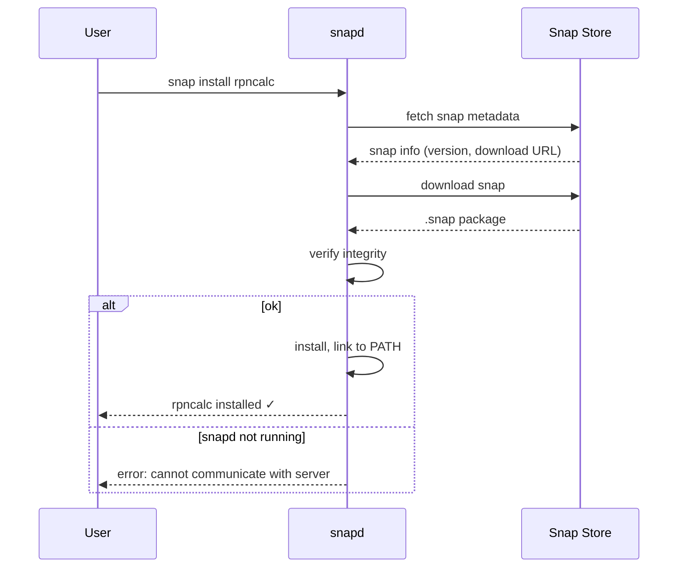

# Behaviour: User installs rpncalc via Snap Store

## Actor
CLI power user (Ubuntu, Fedora, Debian, or any Linux distro with snapd installed)

## Preconditions
- snapd is installed and running on the user's system (pre-installed on Ubuntu; installable on most distros)
- The `rpncalc` snap has been published to the Snap Store by the maintainer
- User has internet access

## Main Flow
1. User runs `snap install rpncalc`.
2. snapd contacts the Snap Store, finds the `rpncalc` snap, and downloads it.
3. snapd verifies the snap's integrity.
4. snapd installs the snap and makes `rpncalc` available on PATH.
5. User runs `rpncalc` and the calculator starts.

## Alternate Flows

### Upgrading an existing installation
- **Trigger:** A newer snap revision has been published to the Snap Store
- **Steps:**
  1. snapd automatically checks for updates in the background (default: 4 times/day).
  2. snapd downloads and installs the new revision silently.
- **Outcome:** New version is active; user gets the update without any manual action.

### Manual upgrade
- **Trigger:** User wants to upgrade immediately rather than wait for auto-refresh
- **Steps:**
  1. User runs `snap refresh rpncalc`.
  2. snapd downloads and installs the latest revision.
- **Outcome:** Latest version is installed immediately.

### snapd not installed
- **Trigger:** User's distro does not have snapd pre-installed
- **Steps:**
  1. `snap install` command not found.
  2. User installs snapd via their distro's package manager (e.g. `sudo dnf install snapd`).
  3. User re-runs `snap install rpncalc`.
- **Outcome:** rpncalc installed after snapd setup.

## Postconditions
- `rpncalc` is available on the user's PATH
- snapd tracks the installation; `snap list` includes rpncalc
- snapd will automatically refresh rpncalc when new revisions are published

## Error Conditions
- **Snap not found** (`snap install rpncalc` returns "error: snap not found"): package has not been published to the Snap Store yet; user falls back to `curl` installer.
- **snapd not running** (`snap install` fails with "cannot communicate with server"): snapd service is not active; user runs `sudo systemctl enable --now snapd` and retries.
- **Confinement blocks terminal access**: snap strict confinement may prevent rpncalc from accessing the terminal correctly; resolved by publishing with `confinement: classic` (requires Snap Store manual review) or using `devmode` for testing.

## Flow

## Related
- `../install-via-aur/usecase.md` — sibling; equivalent pattern for Arch Linux users
- `../install-via-curl/usecase.md` — sibling; fallback install path when snapd is unavailable
- `../cargo-dist-release-pipeline/usecase.md` — upstream; produces the binary that the snap packages

## Acceptance Criteria

**AC-1: Fresh install places rpncalc on PATH**
- Given snapd is installed and the `rpncalc` snap is published to the Snap Store
- When the user runs `snap install rpncalc`
- Then rpncalc is available on PATH and `snap list` shows the installed version

**AC-2: Auto-refresh installs new version without user action**
- Given rpncalc is installed via snap and a newer revision is published
- When snapd performs its background refresh check
- Then the new revision is installed automatically and the user gets the update without running any command

**AC-3: Manual refresh works**
- Given rpncalc is installed via snap
- When the user runs `snap refresh rpncalc`
- Then the latest published revision is installed

**AC-4: Snap not found gives actionable error**
- Given the `rpncalc` snap is not published to the Snap Store
- When the user runs `snap install rpncalc`
- Then snapd reports "snap not found" and the user is not left with a broken state

**AC-5: Classic confinement allows full terminal access**
- Given rpncalc is published with `confinement: classic`
- When the user installs and runs rpncalc in a terminal
- Then stdin, stdout, and terminal control sequences work correctly without confinement errors

## Implementations <!-- taproot-managed -->
- [snapcraft](./snapcraft/impl.md)

## Status
- **State:** implemented
- **Created:** 2026-03-25
- **Last reviewed:** 2026-03-25

## Notes
- Classic confinement (required for full terminal access) requires manual approval from Canonical. The snap must be submitted for review before it can be published with classic confinement. Until approved, `devmode` confinement can be used for testing (`snap install --devmode rpncalc`).
- The snap packages the pre-built binary from GitHub Release rather than building from source in the snap build pipeline. This keeps the snap build simple and consistent with other distribution channels.
- Snap auto-refresh can be disruptive for CLI tools. Users can disable auto-refresh for rpncalc with `snap refresh --hold rpncalc` if they prefer manual control.
- Snapcraft (the snap build tool) can be integrated into the GitHub Actions release pipeline to publish a new snap revision automatically on each release tag.
