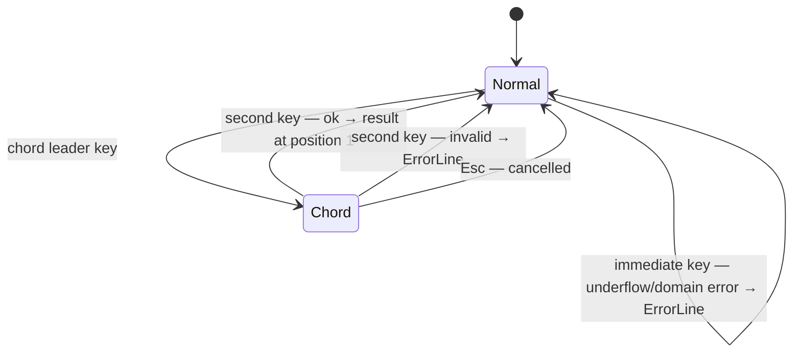

# UseCase: User applies a mathematical operation to stacked values

## Actor
User (CLI power user)

## Preconditions
- rpnpad is running in normal mode
- Stack has sufficient depth (≥2 for binary ops, ≥1 for unary ops;
  constants require no operands)

## Main Flow
1. User triggers an operation:
   - **Immediate key** (normal mode): `+` `-` `*` `/` `^` `%` `!` `n` —
     executes directly without a chord
   - **Chord sequence**: user presses a leader key (`t` `l` `f` `c` `C` etc.),
     hints pane switches to submenu, user presses second key to execute
2. Engine pops required operands, computes result, pushes result onto stack
3. Stack display updates immediately with the new value

## Alternate Flows
- **Constants (π, e, φ)**: no operands consumed; value is pushed directly
  onto the stack as an additional item
- **Negate (`n`)**: unary — flips sign of position 1 in-place

## Error Conditions
- **Stack underflow**: fewer operands than required — error on ErrorLine,
  stack unchanged
- **Domain error** (e.g. `sqrt(-1)`, `ln(0)`, `0÷0`): error on ErrorLine,
  stack unchanged; no partial state written

## Postconditions
- For binary ops: stack depth decreases by 1; result at position 1
- For unary ops: stack depth unchanged; result replaces position 1
- For constants: stack depth increases by 1; constant value at position 1

## Flow

## Acceptance Criteria
**AC-1:** Given the stack has sufficient depth, when the user presses an immediate operation key (e.g. `+`), then the operation executes and the result is at the top of the stack.

**AC-2:** Given the stack has ≥2 items, when a binary operation is applied, then the stack depth decreases by 1 and the result is at position 1.

**AC-3:** Given the stack has insufficient depth for the chosen operation, when the key is pressed, then an error is shown on the ErrorLine and the stack is unchanged.

**AC-4:** Given a domain error occurs (e.g. sqrt of a negative number), when the operation executes, then an error is shown on the ErrorLine and the stack is unchanged.

## Related
- **Sibling**: [User switches numeric mode mid-session](../switch-numeric-mode/usecase.md)
- **Parent intent**: [Mathematical Operations](../../intent.md)
- **Used via**: [User executes an operation via chord sequence](../../discoverability/execute-chord-operation/usecase.md)

## Implementations <!-- taproot-managed -->
- [Apply Operation](./tui/impl.md)

## Status
- **State:** implemented
- **Created:** 2026-03-21
- **Last reviewed:** 2026-03-26
