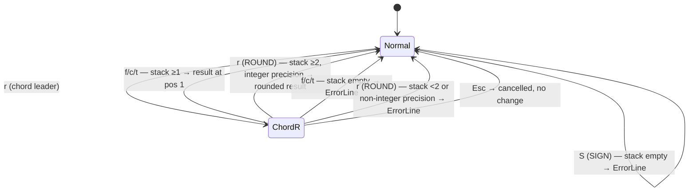

# Behaviour: User applies rounding and sign operations to stacked values

## Actor
User (CLI power user)

## Preconditions
- rpncalc is running in Normal mode
- Stack has ≥1 item for FLOOR, CEIL, TRUNC, SIGN (unary)
- Stack has ≥2 items for ROUND (binary: value at pos 2, integer precision at pos 1)

## Main Flow
1. User initiates a rounding or sign operation:
   - **`r›` chord (FLOOR/CEIL/TRUNC/ROUND)**: User presses `r` (chord leader); hints pane switches to the `r›` submenu showing `f  ⌊x⌋`, `c  ⌈x⌉`, `t  trunc`, `r  RND↓`; user presses the second key.
   - **Direct key (SIGN)**: User presses `S` (shift-s) in Normal mode.
2. Engine applies the operation:
   - **FLOOR** (`rf`): replaces pos 1 with ⌊x⌋ (largest integer ≤ x)
   - **CEIL** (`rc`): replaces pos 1 with ⌈x⌉ (smallest integer ≥ x)
   - **TRUNC** (`rt`): replaces pos 1 with the integer part, truncated toward zero
   - **ROUND** (`rr`): pops precision n from pos 1, rounds pos 2 to n decimal places (n may be negative to round to powers of 10), result replaces pos 2; stack depth decreases by 1
   - **SIGN** (`S`): replaces pos 1 with −1 (negative), 0 (zero), or +1 (positive)
3. Stack display updates immediately with the result.
4. Hints pane returns to Normal-mode view.

## Alternate Flows
### Insert mode with pending buffer
- **Trigger:** User presses the direct `S` key or enters `r` chord leader while Insert mode has a non-empty buffer
- **Steps:**
  1. System submits the buffer value onto the stack (same as pressing Enter)
  2. Operation executes as in Main Flow
- **Outcome:** Buffer is pushed then operation applied; result reflects the submitted value

### ROUND with negative precision
- **Trigger:** Pos 1 contains a negative integer n (e.g. −2)
- **Steps:**
  1. User triggers ROUND (`rr`)
  2. Engine rounds pos 2 to the nearest 10^|n| (e.g. n=−2 rounds to nearest 100)
- **Outcome:** Result at pos 2 is rounded to the specified power of 10; stack depth decreases by 1

### Esc cancels chord mid-entry
- **Trigger:** User presses `r` chord leader then `Esc` before pressing the second key
- **Steps:**
  1. System exits chord mode, returns to Normal mode
  2. No operation is applied; stack is unchanged
- **Outcome:** Stack unchanged; hints pane returns to Normal-mode view

## Postconditions
- Unary ops (FLOOR, CEIL, TRUNC, SIGN): stack depth unchanged; result replaces pos 1
- Binary op (ROUND): stack depth decreases by 1; rounded value at pos 1
- Hints pane updates to reflect new stack state
- `r›` chord submenu and `S` direct key appear in hints pane whenever stack depth ≥ 1

## Error Conditions
- **Stack underflow — unary op on empty stack**: User presses `S` or triggers `rf`/`rc`/`rt` with an empty stack — error message on ErrorLine, stack unchanged
- **Stack underflow — ROUND with fewer than 2 items**: User triggers `rr` with ≤1 item on stack — error message on ErrorLine, stack unchanged
- **ROUND with non-integer precision**: Pos 1 contains a non-integer (e.g. 2.5) — error message "precision must be an integer" on ErrorLine, stack unchanged
- **Domain: SIGN of non-numeric value**: Not applicable — SIGN is defined for all real numbers including zero

## Flow

## Related
- `../apply-operation/usecase.md` — defines the general contract for all operations; this behaviour adds a new family of ops within that contract
- `../../discoverability/execute-chord-operation/usecase.md` — the `r›` chord follows the same chord mechanics; no changes to chord infrastructure required
- `../../discoverability/browse-hints-pane/usecase.md` — hints pane must expose `r›` submenu and `S  sgn` in Normal-mode view

## Acceptance Criteria

**AC-1: FLOOR rounds down to nearest integer**
- Given Normal mode and stack depth ≥1 with value 2.7 at pos 1
- When the user presses `r` then `f`
- Then pos 1 is replaced by 2 and stack depth is unchanged

**AC-2: FLOOR of negative number rounds toward −∞**
- Given Normal mode and pos 1 contains −2.3
- When the user presses `r` then `f`
- Then pos 1 is replaced by −3 (not −2)

**AC-3: CEIL rounds up to nearest integer**
- Given Normal mode and stack depth ≥1 with value 2.1 at pos 1
- When the user presses `r` then `c`
- Then pos 1 is replaced by 3

**AC-4: TRUNC truncates toward zero**
- Given Normal mode and pos 1 contains −2.7
- When the user presses `r` then `t`
- Then pos 1 is replaced by −2 (not −3; truncation toward zero, not FLOOR)

**AC-5: ROUND rounds pos 2 to n decimal places**
- Given Normal mode, pos 1 = 3 (precision), pos 2 = 3.14159
- When the user presses `r` then `r`
- Then pos 2 is replaced by 3.142 and stack depth decreases by 1

**AC-6: ROUND with negative precision rounds to power of 10**
- Given Normal mode, pos 1 = −2 (precision), pos 2 = 1234.5
- When the user presses `r` then `r`
- Then pos 2 is replaced by 1200 and stack depth decreases by 1

**AC-7: SIGN returns −1 for negative values**
- Given Normal mode and pos 1 contains −5.0
- When the user presses `S`
- Then pos 1 is replaced by −1

**AC-8: SIGN returns 0 for zero**
- Given Normal mode and pos 1 contains 0
- When the user presses `S`
- Then pos 1 is replaced by 0

**AC-9: SIGN returns +1 for positive values**
- Given Normal mode and pos 1 contains 42
- When the user presses `S`
- Then pos 1 is replaced by 1

**AC-10: r› chord submenu appears in hints pane**
- Given Normal mode with stack depth ≥1
- When the hints pane renders
- Then `r›` chord leader and `S  sgn` appear in the Normal-mode view

**AC-11: Stack underflow on FLOOR/CEIL/TRUNC/SIGN shows error**
- Given Normal mode and an empty stack
- When the user triggers any unary rounding op or SIGN
- Then an error is shown on ErrorLine and the stack is unchanged

**AC-12: ROUND underflow shows error**
- Given Normal mode and stack depth = 1
- When the user presses `r` then `r`
- Then an error is shown on ErrorLine and the stack is unchanged

**AC-13: ROUND with non-integer precision shows error**
- Given Normal mode, pos 1 = 2.5 (non-integer), pos 2 = any value
- When the user presses `r` then `r`
- Then an error message is shown on ErrorLine and the stack is unchanged

**AC-14: Esc cancels r› chord without side effects**
- Given Normal mode, user has pressed `r` (chord leader)
- When the user presses `Esc`
- Then the hints pane returns to Normal-mode view and the stack is unchanged

## Implementations <!-- taproot-managed -->
- [TUI](./tui/impl.md)

## Status
- **State:** specified
- **Created:** 2026-03-25
- **Last reviewed:** 2026-03-25

## Notes
- FLOOR vs TRUNC distinction matters for negatives: FLOOR(−2.7) = −3, TRUNC(−2.7) = −2. Both must be present.
- ROUND precision n: positive n = decimal places; n = 0 = round to integer; negative n = round to 10^|n|. This matches HP48 RND semantics.
- SIGN is defined for all real numbers; no domain error case.
- `r` is currently unused in Normal mode — safe to assign as chord leader.
- `S` (shift-s) is free — `s` (lowercase) is swap.
