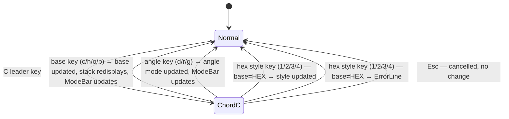

# UseCase: User switches numeric mode mid-session

## Actor
User (CLI power user)

## Preconditions
- rpnpad is running in normal mode

## Main Flow
1. User presses `C` to enter the `C›` config chord; hints pane switches to the config submenu.
2. User presses one of the mode-switch keys:
   - **Base**: `c` → DEC, `h` → HEX, `o` → OCT, `b` → BIN
   - **Angle mode**: `d` → DEG, `r` → RAD, `g` → GRAD
   - **Hex style** (only available when base is HEX): `1` → `0xFF`, `2` → `$FF`, `3` → `#FF`, `4` → `FFh`
3. All stack values immediately redisplay in the new base/style
4. ModeBar updates to reflect the new active mode; `C›` chord exits

## Alternate Flows
- **Hex style when not in HEX base**: key is treated as `ChordInvalid`; error shown on ErrorLine; chord exits without changing state

## Error Conditions
- **Hex style key when not in HEX base:** pressing a hex style key (`1`–`4`) while the active base is not HEX → `ChordInvalid` error shown on ErrorLine; chord exits without changing state

## Postconditions
- Active mode is updated in CalcState
- All subsequent trig operations use the new angle mode
- All subsequent display renders use the new base and representation style

## Flow

## Acceptance Criteria
**AC-1:** Given the user presses `C` then a base key (`c`/`h`/`o`/`b`), then all stack values redisplay in the new base and the ModeBar updates.

**AC-2:** Given the user presses `C` then an angle key (`d`/`r`/`g`), then the active angle mode updates and the ModeBar reflects the change.

**AC-3:** Given the user is in HEX base and presses `C` then a hex style key (`1`–`4`), then the hex representation style updates and stack values redisplay in the new style.

## Related
- **Sibling**: [User applies a mathematical operation to stacked values](../apply-operation/usecase.md)
- **Parent intent**: [Mathematical Operations](../../intent.md)
- **Used via**: [User executes an operation via chord sequence](../../discoverability/execute-chord-operation/usecase.md)

## Implementations <!-- taproot-managed -->
- [Switch Numeric Mode](./tui/impl.md)

## Status
- **State:** implemented
- **Created:** 2026-03-21
- **Last reviewed:** 2026-03-27
