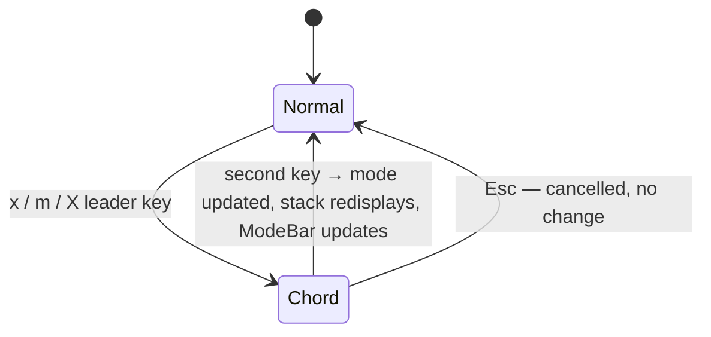

# UseCase: User switches numeric mode mid-session

## Actor
User (CLI power user)

## Preconditions
- rpncalc is running in normal mode

## Main Flow
1. User triggers a mode switch via chord:
   - **Base** (`x` leader + second key): cycles between DEC / HEX / OCT / BIN
   - **Angle mode** (`m` leader + second key): switches between DEG / RAD / GRAD
   - **Hex style** (`X` leader + second key): cycles representation prefix
     (`0xFF` → `$FF` → `#FF` → `FFh`) — only active in HEX base
2. All stack values immediately redisplay in the new base/style
3. ModeBar updates to reflect the new active mode

## Alternate Flows
- **Hex style when not in HEX base**: chord is a no-op (or unavailable
  in hints pane context)

## Error Conditions
- None — mode switching cannot fail

## Postconditions
- Active mode is updated in CalcState
- All subsequent trig operations use the new angle mode
- All subsequent display renders use the new base and representation style

## Flow

## Acceptance Criteria
**AC-1:** Given the user presses the `x` chord leader followed by a base key (e.g. `h` for HEX), then all stack values redisplay in the new base and the ModeBar updates.

**AC-2:** Given the user presses the `m` chord leader followed by an angle key (e.g. `r` for RAD), then the active angle mode updates and the ModeBar reflects the change.

**AC-3:** Given the user presses the `X` chord leader followed by a style key, then the hex representation style updates and stack values redisplay in the new style.

## Related
- **Sibling**: [User applies a mathematical operation to stacked values](../apply-operation/usecase.md)
- **Parent intent**: [Mathematical Operations](../../intent.md)
- **Used via**: [User executes an operation via chord sequence](../../discoverability/execute-chord-operation/usecase.md)

## Implementations <!-- taproot-managed -->
- [Switch Numeric Mode](./tui/impl.md)

## Status
- **State:** specified
- **Created:** 2026-03-21
- **Last reviewed:** 2026-03-24
