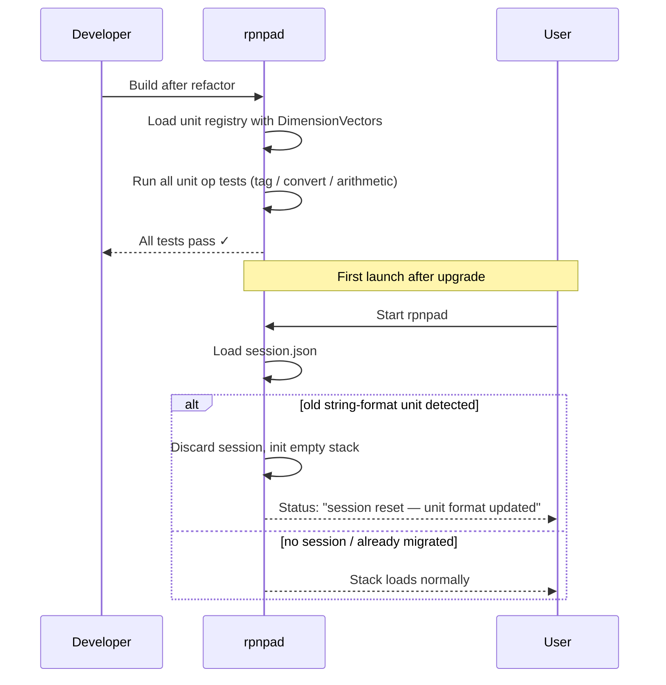

# Behaviour: Compound Unit Data Model

## Actor
rpnpad application (internal refactor — no new user-visible behaviour; the observable outcomes are regression stability and graceful session migration)

## Preconditions
- `unit-aware-values` is fully implemented and all existing tests pass
- Unit registry currently maps unit abbreviations to a scalar `to_base` scale factor

## Main Flow

1. Developer builds rpnpad after the refactor.
2. System loads the unit registry, where every unit now carries a `DimensionVector` — seven signed integer exponents, one per SI base dimension: mass (kg), length (m), time (s), electric current (A), temperature (K), amount (mol), luminous intensity (cd).
3. System constructs a `TaggedValue` for user-entered input (e.g. `1.9 oz`): the value carries both the numeric amount and the unit's `DimensionVector`.
4. System performs all existing unit operations (tag, convert, arithmetic, negate, display) using the dimension vector internally — results are identical to pre-refactor.
5. Developer runs the test suite; all existing tests pass.

## Alternate Flows

### Session contains old string-format unit data
- **Trigger:** User starts rpnpad after upgrade; `session.json` contains `"unit": "oz"` (plain string) rather than a dimension vector.
- **Steps:**
  1. System detects the unrecognised session format on load.
  2. System discards the session, initialises an empty stack.
  3. System displays a one-time status message: `session reset — unit format updated`.
- **Outcome:** User sees empty stack; no crash; no corrupted state.

### Unit with no SI representation (temperature offset)
- **Trigger:** System processes a temperature unit (`°F`, `°C`) which uses an offset scale rather than a pure ratio scale.
- **Steps:**
  1. System records `{K: 1}` as the dimension vector (temperature dimension in Kelvin).
  2. System retains the affine conversion formula alongside the dimension vector.
  3. Addition and subtraction of temperature values continue to use delta arithmetic as before.
- **Outcome:** Temperature units have correct SI dimension; conversion behaviour unchanged.

## Postconditions
- Every unit in the registry has a `DimensionVector` with correct SI exponents.
- `TaggedValue` stores a `DimensionVector` in addition to (or replacing) the unit abbreviation string.
- All existing unit-tagged operations produce identical user-visible results.
- Serde round-trip for `TaggedValue` preserves the dimension vector.
- Old session files with string-format units are discarded gracefully with a status message.

## Error Conditions
- **Unrecognised session format:** system cannot parse `session.json` unit field → discard session, start fresh, show `session reset — unit format updated`. No crash.

## Flow

## Related
- `./unit-aware-values/usecase.md` — provides the existing simple-unit implementation being refactored; all its ACs must continue to pass
- `./compound-unit-operations/usecase.md` — depends on this model; compound unit entry and arithmetic are not possible without the dimension vector

## Acceptance Criteria

**AC-1: All existing unit-tagged tests pass after refactor**
- Given the compound-unit-model refactor is applied
- When the full test suite runs
- Then all previously-passing unit-tagged tests continue to pass (no regressions)

**AC-2: Unit registry exposes correct SI dimensions**
- Given the refactored unit registry
- When the dimension vector for each unit is inspected
- Then: `oz`/`lb`/`g`/`kg` → `{kg: 1}`; `mm`/`cm`/`m`/`km`/`ft`/`in`/`yd`/`mi` → `{m: 1}`; `°F`/`°C` → `{K: 1}`; `s` → `{s: 1}`

**AC-3: TaggedValue serde round-trip preserves dimension vector**
- Given a `TaggedValue` with a compound dimension vector (e.g. `{m: 1, s: -1}`)
- When the value is serialised to JSON and deserialised
- Then the restored value has an identical dimension vector

**AC-4: Old session discarded gracefully**
- Given `session.json` contains a `TaggedValue` with `"unit": "oz"` (string format)
- When rpnpad starts
- Then the stack is empty and the status bar shows `session reset — unit format updated`

**AC-5: Fresh start after session discard**
- Given the session was discarded on load (AC-4)
- When the user pushes `1.9 oz` and performs any unit operation
- Then the operation completes correctly with no errors

## Status
- **State:** proposed
- **Created:** 2026-03-26
- **Last reviewed:** 2026-03-26

## Notes
- The seven SI base dimensions are: mass (kg), length (m), time (s), electric current (A), thermodynamic temperature (K), amount of substance (mol), luminous intensity (cd). All derived units are expressed as integer exponents of these seven.
- Temperature (°F/°C) is an offset scale, not a ratio scale. The dimension is `{K: 1}` but conversion requires the existing affine formula. Delta arithmetic (temperature + temperature as offset) continues unchanged.
- `TaggedValue` may retain the user's chosen unit abbreviation for display purposes (so `1.9 oz` still shows `oz` not `kg`), while carrying the dimension vector for arithmetic type-checking.
