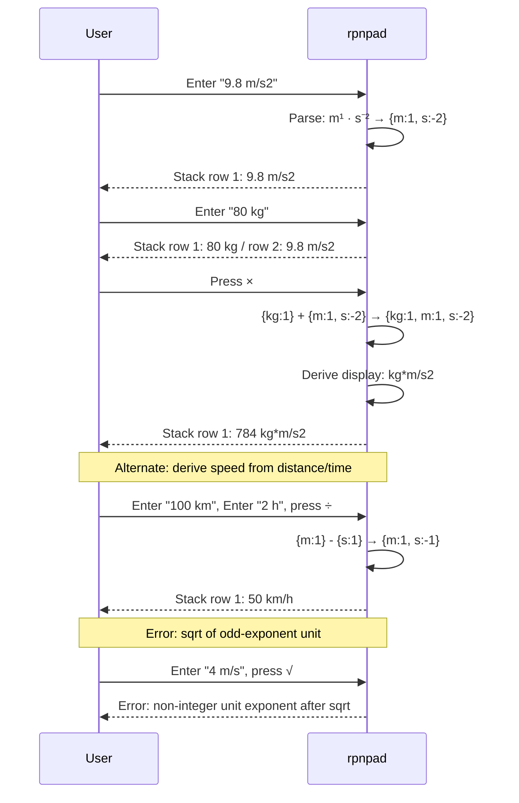

# Behaviour: Compound Unit Operations

## Actor
CLI power user (engineer, scientist, or anyone computing with derived physical quantities such as speed, force, or area)

## Preconditions
- rpnpad is running
- `compound-unit-model` is implemented (dimension vectors in registry and `TaggedValue`)
- For arithmetic flows: the relevant values are on the stack

## Main Flow

1. User types a compound-unit value (e.g. `9.8 m/s2`) in the input line and presses Enter.
2. System parses the compound unit expression, resolves each atom against the unit registry, and derives the combined `DimensionVector`.
3. System pushes the value with its compound unit onto the stack.
4. Stack row displays the value with its compound unit label (e.g. `9.8 m/s2`).
5. User pushes a second value carrying a compatible unit (e.g. `80 kg`) and presses `×`.
6. System multiplies the numeric amounts and adds the dimension exponents: `{kg: 1} + {m: 1, s: -2}` → `{kg: 1, m: 1, s: -2}`.
7. System derives the canonical display string from the resulting dimension vector (e.g. `kg*m/s2`).
8. Stack displays the result (e.g. `784 kg*m/s2`).

## Alternate Flows

### Derive speed from distance ÷ time
- **Trigger:** User divides a length value by a time value.
- **Steps:**
  1. Stack has `2 h` at position 1 and `100 km` at position 2.
  2. User presses `÷`.
  3. System subtracts dimension exponents: `{m: 1}` − `{s: 1}` → `{m: 1, s: -1}`.
  4. System maps `{m: 1, s: -1}` to display `m/s` (or `km/h` if both operands were in those units — see Notes).
  5. Stack displays `50 km/h`.

### Multiply speed × time → distance (dimension cancellation)
- **Trigger:** User multiplies a compound-unit value by a simple unit that cancels one dimension.
- **Steps:**
  1. Stack has `2 h` at position 1 and `50 km/h` at position 2.
  2. User presses `×`.
  3. System adds exponents: `{m: 1, s: -1}` + `{s: 1}` → `{m: 1}`.
  4. Stack displays `100 km`.

### Area from two length values
- **Trigger:** User multiplies two length values.
- **Steps:**
  1. Stack has `3 m` and `5 m`.
  2. User presses `×`.
  3. System adds exponents: `{m: 1}` + `{m: 1}` → `{m: 2}`.
  4. Stack displays `15 m2`.

### Square root reduces dimension exponents by half
- **Trigger:** User invokes `√` on a value whose dimension exponents are all even.
- **Steps:**
  1. Stack has `25 m2`.
  2. User invokes `√`.
  3. System halves each exponent: `{m: 2}` → `{m: 1}`.
  4. Stack displays `5 m`.
- **Error:** If any exponent is odd, system shows error `non-integer unit exponent after sqrt`.

### Scalar × compound unit
- **Trigger:** One operand is a plain (unitless) number.
- **Steps:**
  1. Stack has `9.8 m/s2` and `2` (plain).
  2. User presses `×`.
  3. System multiplies the amounts; result carries the compound unit unchanged.
  4. Stack displays `19.6 m/s2`.

### Dimensionless result
- **Trigger:** Division of two values with identical dimension vectors.
- **Steps:**
  1. Stack has `10 m/s` at position 2 and `5 m/s` at position 1.
  2. User presses `÷`.
  3. Dimension exponents cancel to `{}` (all zeros).
  4. Stack displays the plain number `2` with no unit label.

### Add two same-compound-unit values
- **Trigger:** User adds two values with identical dimension vectors.
- **Steps:**
  1. Stack has `1 m/s` at position 2 and `2 m/s` at position 1.
  2. User presses `+`.
  3. System verifies dimension vectors match: `{m:1, s:-1}` = `{m:1, s:-1}`.
  4. System adds the amounts; result carries the shared compound unit unchanged.
  5. Stack displays `3 m/s`.

### Reciprocal of a compound-unit value
- **Trigger:** User invokes `1/x` on a compound-unit value.
- **Steps:**
  1. Stack has `9.8 m/s2` at position 1.
  2. User invokes `1/x`.
  3. System computes `1 / 9.8` and negates all dimension exponents: `{m:1, s:-2}` → `{m:-1, s:2}`.
  4. Stack displays `~0.102 s2/m`.
- **Note:** If `1/x` is applied to a unitless value, existing behaviour is unchanged (no unit produced).

### Convert compound unit to compatible compound unit
- **Trigger:** User converts a compound-unit value to a compatible compound unit (e.g. `m/s` → `km/h`).
- **Steps:**
  1. Stack has `27.78 m/s` at position 1.
  2. User invokes convert with target `km/h`.
  3. System verifies dimension vectors match, performs scale conversion.
  4. Stack displays `100 km/h`.

## Postconditions
- On successful push: stack grows by one; entry displays value and compound unit label.
- On successful arithmetic: stack shrinks by one; result carries the derived compound unit (or no unit if dimensionless).
- Compound-unit values persist to `session.json` and restore with unit labels intact after restart.

## Error Conditions
- **Unrecognised unit atom:** user enters `9.8 m/fathom2` → error `unknown unit: fathom`; input not pushed.
- **Non-integer exponent after sqrt:** user invokes `√` on `4 m/s` (exponent −1 is odd) → error `non-integer unit exponent after sqrt`.
- **Incompatible units in addition/subtraction:** `1 m/s + 1 m/s2` → error `incompatible units: m/s and m/s2`; stack unchanged.
- **Convert to incompatible compound unit:** convert `1 m/s` to `kg` → error `incompatible units: cannot convert m/s to kg`; stack unchanged.
- **Malformed compound unit expression:** user enters `9.8 m//s` → error `invalid unit expression: m//s`; input not pushed.

## Flow

## Related
- `./compound-unit-model/usecase.md` — must be implemented first; this behaviour requires dimension vectors on `TaggedValue`
- `./unit-aware-values/usecase.md` — shares the unit registry, parser, `CalcValue::Tagged`, and convert infrastructure; simple-unit ACs must continue to pass

## Acceptance Criteria

**AC-1: Enter a speed value**
- Given rpnpad is running
- When the user enters `100 km/h` and presses Enter
- Then the stack displays one entry: `100 km/h`

**AC-2: Enter an acceleration value**
- Given rpnpad is running
- When the user enters `9.8 m/s2` and presses Enter
- Then the stack displays one entry: `9.8 m/s2`

**AC-3: Derive speed by dividing distance by time**
- Given the stack has `100 km` at position 2 and `2 h` at position 1
- When the user presses `÷`
- Then the stack displays `50 km/h`

**AC-4: Derive distance by multiplying speed × time (dimension cancellation)**
- Given the stack has `50 km/h` at position 2 and `2 h` at position 1
- When the user presses `×`
- Then the stack displays `100 km`

**AC-5: Area from two length values**
- Given the stack has `5 m` at position 2 and `3 m` at position 1
- When the user presses `×`
- Then the stack displays `15 m2`

**AC-6: Force from mass × acceleration**
- Given the stack has `80 kg` at position 2 and `9.8 m/s2` at position 1
- When the user presses `×`
- Then the stack displays `784 kg*m/s2`

**AC-7: Dimensionless result from same-compound-unit division**
- Given the stack has `10 m/s` at position 2 and `5 m/s` at position 1
- When the user presses `÷`
- Then the stack displays the plain number `2` with no unit label

**AC-8: Scalar × compound unit preserves unit**
- Given the stack has `2` (unitless) at position 2 and `9.8 m/s2` at position 1
- When the user presses `×`
- Then the stack displays `19.6 m/s2`

**AC-9: sqrt reduces even-exponent compound unit**
- Given the stack has `25 m2` at position 1
- When the user invokes `√`
- Then the stack displays `5 m`

**AC-10: sqrt on odd-exponent compound unit — error**
- Given the stack has `4 m/s` at position 1
- When the user invokes `√`
- Then an error `non-integer unit exponent after sqrt` is shown and the stack is unchanged

**AC-11: Incompatible compound units in addition — error**
- Given the stack has `1 m/s` at position 2 and `1 m/s2` at position 1
- When the user presses `+`
- Then an error `incompatible units` is shown and both values remain on the stack

**AC-12: Unrecognised unit atom — error**
- Given rpnpad is running
- When the user enters `9.8 m/fathom2` and presses Enter
- Then an error `unknown unit: fathom` is shown and the stack is unchanged

**AC-13: Compound-unit values survive session restart**
- Given the stack has `9.8 m/s2` and rpnpad is closed and reopened
- Then the stack still displays `9.8 m/s2`

**AC-14: Convert compound unit to compatible compound unit**
- Given the stack has `27.78 m/s` at position 1
- When the user converts to `km/h`
- Then position 1 is replaced with `100 km/h` (within rounding tolerance)

**AC-15: Add two same-compound-unit values**
- Given the stack has `1 m/s` at position 2 and `2 m/s` at position 1
- When the user presses `+`
- Then the stack displays `3 m/s`

**AC-16: Reciprocal of a compound-unit value**
- Given the stack has `4 m/s2` at position 1
- When the user invokes `1/x`
- Then the stack displays `0.25 s2/m`

## Implementations <!-- taproot-managed -->
- [tui](./tui/impl.md)

## Status
- **State:** implemented
- **Created:** 2026-03-26
- **Last reviewed:** 2026-03-26

## Notes
- **Input grammar**: `<unit-expr>` = `<numerator> [ "/" <denominator> ]`; `<numerator>` / `<denominator>` = `<atom> (("*" | " ") <atom>)*`; `<atom>` = `<abbrev> [ ["-"] <digits> ]`. Both `*` (Shift+8) and a single space are accepted as numerator separators in input. Characters requiring more than one modifier key or a compose sequence (e.g. `·` middle dot, `²` superscript) are not accepted — use ASCII digits for exponents (e.g. `m2` not `m²`). Examples: `m/s`, `m/s2`, `kg*m/s2`, `kg m/s2`, `m2`.
- **Space separator required for compound entry**: when typing a compound unit value in Insert mode, the space between the coefficient and the unit expression is mandatory for compound units containing `/` (e.g. `1 m/s`, not `1m/s`). The space signals unit expression context, suppressing the `/` operation shortcut. Simple units without `/` remain space-optional (e.g. `1.9oz` continues to work).
- **Display format**: numerator atoms joined with `*`, denominator (negative-exponent) atoms after `/` with their absolute exponent. E.g. `{kg:1, m:1, s:-2}` displays as `kg*m/s2`. Dimensionless result (all exponents zero) displays as a plain number.
- **Unit display for derived results**: when the result dimension matches a known named unit (e.g. `{m:1, s:-1}` for km/h), prefer the most natural unit given the operands' units. If the match is ambiguous or unknown, construct the display from the dimension vector.
- **Temperature in compound units**: temperature as a compound operand uses Kelvin semantics (ratio scale). Offset units (°F, °C) are only valid as standalone simple-unit values, not as atoms in a compound unit expression.
- AC-3 and AC-4 rounding tolerance: match the display precision in effect at time of arithmetic.
