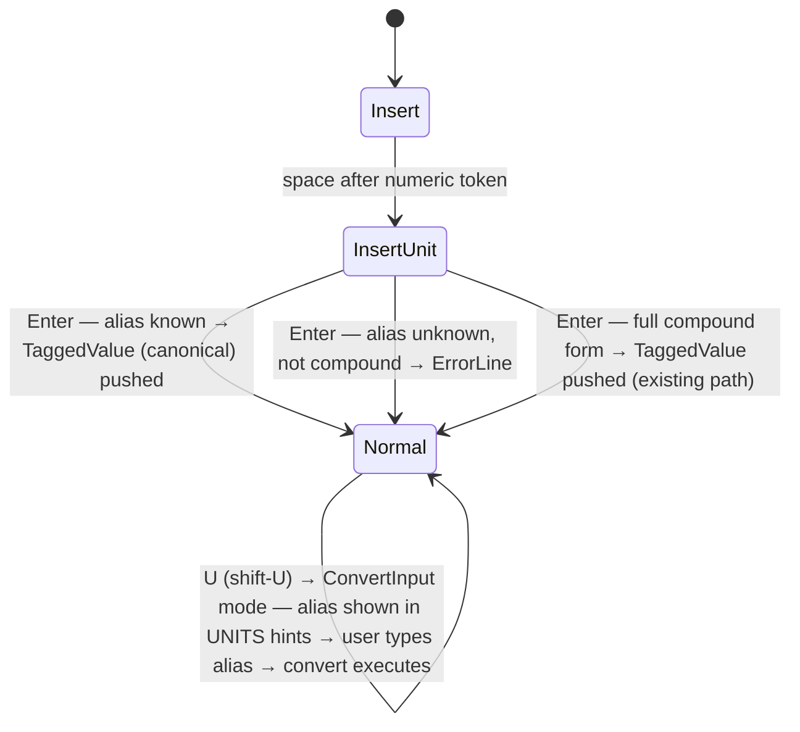

# Behaviour: User enters a value with a common unit alias

## Actor
User (CLI power user — engineer or scientist entering physical quantities)

## Preconditions
- rpnpad is running in Normal or Insert mode
- User knows a common unit alias (e.g. `N`, `kph`, `Pa`) but not necessarily the full compound expression

## Main Flow
1. User enters a numeric value followed by a unit alias (e.g. `9.8 N`, `100 kph`, `101325 Pa`) using the normal Insert + InsertUnit entry flow.
2. Parser recognises the alias in its lookup table and resolves it to the canonical compound unit expression (e.g. `N` → `kg*m/s2`, `kph` → `km/h`, `Pa` → `kg/m*s2`).
3. rpnpad pushes a `TaggedValue` onto the stack using the canonical compound expression and its corresponding `DimensionVector` — identical to what would result from typing the full compound form directly.
4. Stack display shows the value with its canonical unit label (e.g. `9.8 kg*m/s2`).

## Alternate Flows

### Direct compound entry
- **Trigger:** User types the full compound form (`9.8 kg*m/s2`) directly
- **Steps:**
  1. Parser matches via the existing compound-unit path (no alias lookup needed)
  2. TaggedValue pushed with the canonical expression as-is
- **Outcome:** Identical result — alias entry and direct entry are equivalent

### Alias used as conversion target
- **Trigger:** User has a force-dimensioned value on the stack and presses `U` (shift-U) to enter ConvertInput mode
- **Steps:**
  1. Hints pane UNITS section shows alias names alongside other compatible units (e.g. `N`, `dyn`, `lbf`)
  2. User types `N` in InsertUnit mode
  3. Parser resolves `N` → `kg*m/s2` and performs the conversion
- **Outcome:** Value converted to the target unit; stack displays canonical label

### Unknown alias — falls through to error
- **Trigger:** User enters a string that is not a known simple unit, known alias, or valid compound expression (e.g. `9.8 xyz`)
- **Steps:**
  1. Parser finds no alias match, no simple-unit match, and no valid compound parse
  2. Error returned: `unknown unit: xyz`
- **Outcome:** Error shown on ErrorLine; stack unchanged

### Alias with no matching dimension in hints UNITS section
- **Trigger:** Stack top dimension does not match any alias (e.g. stack top is `m/s2` — acceleration — which has no alias in the table)
- **Steps:**
  1. Hints pane UNITS section renders without alias rows for that dimension
- **Outcome:** No change to existing UNITS rendering; raw compound units shown if applicable

## Postconditions
- `TaggedValue` on the stack uses the canonical compound unit string and `DimensionVector`, indistinguishable from direct compound entry
- Hints pane UNITS section shows alias names (e.g. `N`, `Pa`) as named conversion targets when the stack top's dimension matches a known alias — requires the UNITS section to display a list of compatible targets (may need extension if not already present)
- No change to how arithmetic, conversion, or session persistence work downstream

## Error Conditions
- **Alias string is a valid alias but stack operation fails (e.g. unknown unit atom in expansion):** Internal error — `invalid unit expression: <expansion>` on ErrorLine, stack unchanged. (Should not occur for well-defined aliases in the table.)
- **User types an alias-like string in a context that doesn't accept units (e.g. Alpha mode):** treated as literal text, not as a unit alias — no alias lookup runs

## Flow

## Related
- `../unit-aware-values/usecase.md` — defines the base unit-entry flow; alias resolution is an extension of the same InsertUnit path
- `../compound-unit-operations/usecase.md` — alias-resolved TaggedValues are arithmetic-compatible with directly-entered compound units; same engine path
- `../../discoverability/browse-hints-pane/usecase.md` — UNITS section of the hints pane must surface alias names as conversion targets; rendering extension

## Acceptance Criteria

**AC-1: Known alias resolves to canonical compound expression**
- Given Normal mode and the alias `N` is in the alias table mapping to `kg*m/s2`
- When the user enters `9.8 N`
- Then a TaggedValue `9.8 kg*m/s2` is pushed onto the stack, identical to entering `9.8 kg*m/s2` directly

**AC-2: Alias-resolved value converts correctly** *(deferred — `dyn` and `lbf` not yet in unit registry)*
- Given a TaggedValue `9.8 kg*m/s2` (entered via alias `N`) is at stack position 1
- When the user converts to `dyn`
- Then the result is `980000 dyn` and the stack updates correctly

**AC-3: Alias-resolved value participates in arithmetic**
- Given `9.8 N` (alias) at position 2 and `1 kg` at position 1
- When the user divides
- Then the result is `9.8 m/s2` (dimensionally correct: kg*m/s2 ÷ kg = m/s2)

**AC-4: Speed alias kph resolves correctly**
- Given the alias `kph` maps to `km/h`
- When the user enters `100 kph`
- Then a TaggedValue `100 km/h` is pushed onto the stack

**AC-5: Alias names appear in UNITS hints as conversion targets**
- Given a force-dimensioned value (`kg*m/s2`) is at stack position 1 and Normal mode is active
- When the hints pane renders the UNITS section
- Then `N` appears as a named conversion target alongside `dyn`, `lbf`, etc.

**AC-6: Unknown unit string still errors**
- Given the string `xyz` is not a known alias, simple unit, or valid compound expression
- When the user enters `9.8 xyz`
- Then an error `unknown unit: xyz` is shown on ErrorLine and the stack is unchanged

**AC-7: Direct compound entry unchanged**
- Given the user types `9.8 kg*m/s2` directly (no alias)
- When the value is pushed
- Then the result is identical to entering `9.8 N` via alias — same TaggedValue, same DimensionVector

**AC-8: Alias as conversion target in ConvertInput mode**
- Given a force-dimensioned value is at stack position 1 and the user presses `U` (shift-U) to enter ConvertInput mode
- When the user types `N` and presses Enter
- Then the value is converted as if `kg*m/s2` had been typed — alias resolves in the conversion path too

**AC-9: Session restore preserves canonical form**
- Given a value `9.8 N` was entered via alias, the session was saved, and rpnpad was restarted
- When the session is restored
- Then the value reloads as `9.8 kg*m/s2` — the canonical form is self-sufficient; the alias is not required for restore

**AC-10: Alias+alias arithmetic**
- Given `9.8 N` (alias) at position 2 and `0.2 N` (alias) at position 1
- When the user presses `+`
- Then the result is `10 kg*m/s2` — alias-resolved values combine correctly

## Implementations <!-- taproot-managed -->
- [tui](./tui/impl.md)

## Status
- **State:** implemented
- **Created:** 2026-03-26
- **Last reviewed:** 2026-03-27

## Notes
- **Alias table (initial set):** `N` → `kg*m/s2` (newton), `kph` → `km/h` (speed), `Pa` → `kg/m*s2` (pascal), `J` → `kg*m2/s2` (joule), `W` → `kg*m2/s3` (watt). Extend as needed; the table is the single authoritative source.
- **`Hz` excluded from initial table:** `Hz` = `1/s` (hertz) cannot be expressed as a compound unit string parseable by `parse_unit_expr_atoms` — a dimensionless numerator (`1`) has no unit abbreviation and would fail with `unknown unit: 1`. Defer until the parser supports a `s-1` exponent-only atom notation or a direct `DimensionVector` bypass for special cases.
- **AC-2 dependency:** `dyn` (dyne) and `lbf` (pound-force) are not in the unit table (confirmed). AC-2 is deferred until they are added. `h` (hour) is registered and the `kph` → `km/h` alias path is unblocked.
- **Canonical display:** stack always shows the canonical compound form (e.g. `kg*m/s2`), never the alias. Output-alias display (collapsing to `N` after arithmetic) is explicitly deferred — see backlog.
- **User-defined aliases:** out of scope for this behaviour. The alias table is hardcoded; no config mechanism.
- **Alias lookup order:** alias table checked first; if no match, fall through to existing simple-unit then compound-unit parse paths. This means a future unit added to the simple-unit table that collides with an alias name takes lower priority — alias table wins.
