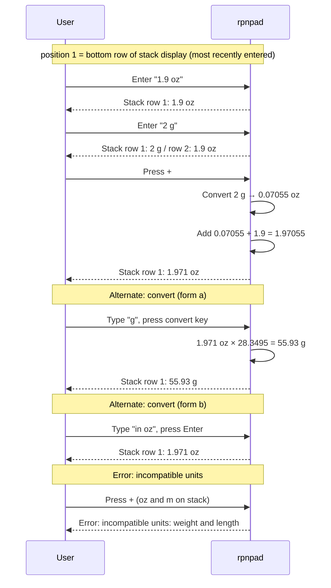

# Behaviour: Unit-Aware Values

## Actor
CLI power user (engineer, scientist, or anyone performing real-world calculations)

## Preconditions
- rpnpad is running
- For conversion: a unit-tagged value is at position 1 on the stack
- For unit arithmetic: at least two values are on the stack, with at least one being unit-tagged

## Main Flow

1. User types a numeric value followed by a recognised unit abbreviation (e.g. `1.9 oz`) in the input line and presses Enter.
2. System parses the input, recognises the unit, and pushes a unit-tagged value onto the stack.
3. Stack row displays the value with its unit label (`1.9 oz`).
4. User pushes a second unit-tagged value in the same category (e.g. `2 g`).
5. User invokes an arithmetic operator (e.g. `+`).
6. System converts position 2's value to position 1's unit, performs the operation, and pushes the result.
7. Stack row displays the result with position 1's unit label (e.g. `57.86 g`).

## Alternate Flows

### Convert to a different unit
- **Trigger:** User has a unit-tagged value at position 1 and wants to convert it to a compatible unit.
- **Steps:**
  1. User invokes convert using one of two equivalent forms:
     - **(a)** Type the target unit abbreviation (e.g. `g`) in the input line and press the convert key
     - **(b)** Type `in g` as a keyword command in the input line and press Enter
  2. System computes the converted value and replaces position 1 with the result in the target unit.
  3. Stack row displays the converted value with the new unit label (e.g. `53.86 g`).

### Arithmetic with identical units (no conversion)
- **Trigger:** Both stack values carry the same unit.
- **Steps:**
  1. User invokes an arithmetic operator.
  2. System performs the operation without conversion; result carries the shared unit.
  3. Stack displays result with the unit label.

### Subtraction between unit-tagged values
- **Trigger:** User invokes `−` on two unit-tagged values.
- **Steps:**
  1. System converts position 2's value to position 1's unit (if different but compatible).
  2. System subtracts and pushes the result with position 1's unit.
  3. Stack displays result with the unit label.

### Temperature conversion
- **Trigger:** User converts a temperature value between °C and °F (non-linear scale).
- **Steps:**
  1. User has a temperature value at position 1 (e.g. `98.6 °F`).
  2. User invokes convert with target unit `°C` (form a or b).
  3. System applies the correct affine formula and replaces position 1 (e.g. `37 °C`).
  4. Stack displays the converted value.

### Arithmetic with temperature values
- **Trigger:** User adds or subtracts two temperature values.
- **Steps:**
  1. System converts position 2's value to position 1's unit using the absolute scale formula.
  2. System performs the arithmetic treating the values as offsets (delta arithmetic) and pushes the result in position 1's unit.
  3. Stack displays the result.
- **Note:** Temperature arithmetic is treated as offset arithmetic. `20 °C + 10 °C = 30 °C` is valid as a delta sum; the result is not a physically absolute temperature.

### Division of same-category values
- **Trigger:** User invokes `÷` on two unit-tagged values from the same category.
- **Steps:**
  1. System converts position 2's value to position 1's unit.
  2. System divides and pushes a dimensionless result (no unit).
  3. Stack displays the plain number.

### Unit-tagged value in arithmetic with a plain (unitless) value
- **Trigger:** One stack operand is unit-tagged; the other is a plain number.
- **Steps:**
  1. System treats the plain number as a dimensionless scalar.
  2. For multiplication or division: result carries the unit of the unit-tagged operand.
  3. For addition or subtraction: system raises an error (cannot add a dimensionless value to a unit-tagged value).

### Negate a unit-tagged value
- **Trigger:** User invokes `±` or negate on a unit-tagged value.
- **Steps:**
  1. System negates the numeric value and preserves the unit tag.
  2. Stack displays the negated value with the unit label (e.g. `-1.9 oz`).

## Postconditions
- On successful tag: stack grows by one; new entry displays value and unit label.
- On successful convert: position 1 is replaced with the converted value; unit label reflects the new unit; stack depth unchanged.
- On successful arithmetic: stack shrinks by one; result carries the appropriate unit label (or no label if the result is dimensionless).
- Unit-tagged values persist to `session.json` with both the numeric value and the unit tag. The stack restores with unit labels intact after a restart.

## Error Conditions
- **Unrecognised unit:** User types an unknown unit abbreviation (e.g. `5 fathoms`) → system shows error "unknown unit: fathoms", input is not pushed onto the stack.
- **Incompatible units in arithmetic:** User invokes `+` or `−` on two unit-tagged values from different categories (e.g. `1 oz + 1 m`) → system shows error "incompatible units: weight and length", stack is unchanged.
- **Incompatible units in division:** User invokes `÷` on two unit-tagged values from different categories → system shows error "compound unit not supported", stack is unchanged.
- **Multiplication of two unit-tagged values:** User invokes `×` on two unit-tagged values → system shows error "compound unit not supported", stack is unchanged.
- **`1/x` or `sqrt` on a unit-tagged value:** System shows error "compound unit not supported", stack is unchanged.
- **Convert to incompatible unit:** User invokes convert targeting a unit from a different category (e.g. convert `1.9 oz` to `m`) → system shows error "incompatible units: cannot convert weight to length", stack is unchanged.
- **Convert on a unitless value:** User invokes convert when position 1 carries no unit → system shows error "no unit: value has no unit to convert", stack is unchanged.
- **Addition/subtraction of unitless and unit-tagged:** User invokes `+` or `−` with one plain number and one unit-tagged value → system shows error "incompatible units", stack is unchanged.

## Flow

## Related
- `taproot/physical-quantities/intent.md` — parent intent; this behaviour fulfils all five success criteria
- `taproot/configuration/configure-settings-chord/usecase.md` — shares the display layer; unit labels appear on the same stack rows that notation/precision affect

## Acceptance Criteria

**AC-1: Tag a value with a weight unit (imperial)**
- Given rpnpad is running with an empty stack
- When the user enters `1.9 oz` and presses Enter
- Then the stack displays one entry: `1.9 oz`

**AC-2: Tag a value with a length unit**
- Given rpnpad is running
- When the user enters `6 ft` and presses Enter
- Then the stack displays one entry: `6 ft`

**AC-3: Convert weight between imperial and metric**
- Given the stack has `1.9 oz` at position 1
- When the user enters `g` and invokes convert
- Then position 1 is replaced with `53.86 g` (within rounding tolerance)

**AC-4: Convert length between imperial and metric**
- Given the stack has `6 ft` at position 1
- When the user enters `m` and invokes convert
- Then position 1 is replaced with `1.8288 m` (within rounding tolerance)

**AC-5: Convert temperature Fahrenheit to Celsius**
- Given the stack has `98.6 °F` at position 1
- When the user enters `°C` and invokes convert
- Then position 1 is replaced with `37 °C` (within rounding tolerance)

**AC-6: Convert temperature Celsius to Fahrenheit**
- Given the stack has `100 °C` at position 1
- When the user enters `°F` and invokes convert
- Then position 1 is replaced with `212 °F` (within rounding tolerance)

**AC-7: Arithmetic with identical units**
- Given the stack has `2 oz` at position 2 and `1.9 oz` at position 1
- When the user presses `+`
- Then the stack displays `3.9 oz`

**AC-8: Arithmetic with compatible units — result in position 1's unit**
- Given the stack has `2 g` at position 2 and `1.9 oz` at position 1
- When the user presses `+`
- Then the stack displays a single value in `oz` equal to the sum of both values converted to oz

**AC-9: Arithmetic with compatible length units**
- Given the stack has `1 ft` at position 2 and `30 cm` at position 1
- When the user presses `+`
- Then the stack displays a single value in `cm` equal to the sum of both values converted to cm

**AC-10: Unrecognised unit — input rejected with error**
- Given rpnpad is running
- When the user enters `5 fathoms` and presses Enter
- Then an error message "unknown unit: fathoms" is shown and the stack is unchanged

**AC-11: Incompatible units in arithmetic — error, stack unchanged**
- Given the stack has `1 oz` at position 2 and `1 m` at position 1
- When the user presses `+`
- Then an error message "incompatible units" is shown and both values remain on the stack

**AC-12: Convert to incompatible unit — error, stack unchanged**
- Given the stack has `1.9 oz` at position 1
- When the user enters `m` and invokes convert
- Then an error message "incompatible units" is shown and position 1 is unchanged

**AC-13: Convert on a unitless value — error**
- Given the stack has a plain number (e.g. `42`) at position 1 with no unit
- When the user enters `g` and invokes convert
- Then an error message "no unit" is shown and the stack is unchanged

**AC-14: Scalar multiplication preserves unit**
- Given the stack has `3` (unitless) at position 2 and `1.9 oz` at position 1
- When the user presses `×`
- Then the stack displays `5.7 oz`

**AC-15: Addition of unitless to unit-tagged — error**
- Given the stack has `3` (unitless) at position 2 and `1.9 oz` at position 1
- When the user presses `+`
- Then an error message "incompatible units" is shown and the stack is unchanged

**AC-16: Convert using lb**
- Given the stack has `1 lb` at position 1
- When the user enters `g` and invokes convert
- Then position 1 is replaced with `453.592 g` (within rounding tolerance)

**AC-17: Division of same-unit values produces dimensionless result**
- Given the stack has `3 oz` at position 2 and `1.5 oz` at position 1
- When the user presses `÷`
- Then the stack displays the plain number `2` with no unit label

**AC-18: Multiplication of two unit-tagged values — error**
- Given the stack has `3 oz` at position 2 and `2 oz` at position 1
- When the user presses `×`
- Then an error message "compound unit not supported" is shown and the stack is unchanged

**AC-19: Space-optional input grammar — no space**
- Given rpnpad is running
- When the user enters `1.9oz` (no space) and presses Enter
- Then the stack displays `1.9 oz` (same as with a space)

**AC-20: Negate a unit-tagged value**
- Given the stack has `1.9 oz` at position 1
- When the user invokes negate
- Then the stack displays `-1.9 oz`

**AC-21: Convert using `in` keyword form**
- Given the stack has `1.9 oz` at position 1
- When the user types `in g` and presses Enter
- Then position 1 is replaced with `53.86 g` (within rounding tolerance)

**AC-22: Unit-tagged values survive session restart**
- Given the stack has `1.9 oz` at position 1 and rpnpad is closed
- When rpnpad is reopened
- Then the stack still displays `1.9 oz` at position 1

**AC-23: ConvertInput hint panel shows only the compatible unit group**
- Given the user presses `U` and the mode bar shows `[UNIT]`
- When the hints pane renders
- Then it displays a mode header `CONVERT TO UNIT`, a key table listing `Enter` (convert), `Esc` (cancel), `Backspace` (delete), and a unit reference showing only the group compatible with the stack top's unit category:
  - If top is a weight value: Weight group only — `g`  `kg`  `lb`  `oz`
  - If top is a length value: Length group only — `cm`  `ft`  `in`  `km`  `m`  `mi`  `mm`  `yd`
  - If top is a temperature value: Temperature group only — `°C`  `°F`  (aliases: `C`  `degC`  `degF`  `F`)
  - If top is a compound unit value (e.g. `km/h`, `m/s2`): a `COMPOUND UNIT` section showing the source unit expression and a prompt to enter a compatible unit expression (same dimensions)

**AC-25: Insert mode hints show unit input syntax**
- Given rpnpad is in Insert mode (user is typing a number)
- When the hints pane renders
- Then it includes a line showing that a unit abbreviation may follow the number, e.g. `1.9 oz`, `6 ft`, `98.6 F`

**AC-26: ConvertInput mode shows typed unit expression in the input line**
- Given rpnpad is in ConvertInput mode
- When the user has typed some characters (e.g. `km`)
- Then the input line displays `> km_` (typed text followed by cursor)
- And when the buffer is empty, the input line displays `> _` (cursor only)

**AC-24: UNITS section in Normal mode is conditional on a tagged stack top**
- Given the stack top is a unit-tagged value
- When the hints pane renders in Normal mode
- Then a `UNITS` section is visible containing: `U  convert`
- And given the stack top is a plain number or the stack is empty
- When the hints pane renders in Normal mode
- Then no `UNITS` section is visible

## Implementations <!-- taproot-managed -->
- [tui](./tui/impl.md)

## Status
- **State:** implemented
- **Created:** 2026-03-25
- **Last reviewed:** 2026-03-26

## Notes
- The internal unit model uses compound unit representation (numerator/denominator dimension vectors) from the outset, so derived units (m/s, kg·m/s²) can be added without refactoring value types. This is invisible to the user in the first delivery.
- Temperature is the only non-linear unit category: conversion uses affine formulae rather than a simple scale factor. Temperature arithmetic is treated as delta/offset arithmetic — `20 °C + 10 °C = 30 °C` is valid. The engine must distinguish "absolute" vs "delta" temperature if strict physical correctness is added in a later phase.
- Unit abbreviation set for first delivery: weight (`oz`, `lb`, `g`, `kg`), length (`in`, `ft`, `yd`, `mi`, `mm`, `cm`, `m`, `km`), temperature (`°F`, `°C`). Exact list is finalised in the implementation spec.
- AC-8/AC-9 rounding tolerance: match the display precision in effect at time of arithmetic.
- A space between the numeric value and the unit abbreviation is optional: `1.9 oz` and `1.9oz` are both valid. Unit abbreviations are case-sensitive (`oz` ≠ `OZ`). Negative values are valid: `-1.9 oz`.
