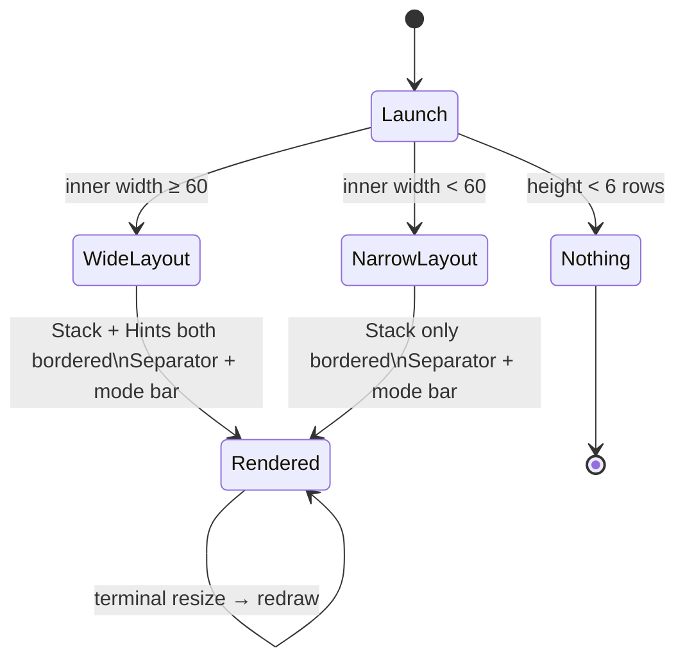

# Behaviour: User sees a visually cohesive TUI layout

## Actor
User (CLI power user)

## Preconditions
- rpncalc is running with the TUI open
- Terminal height ≥ 6 rows (below this, nothing is rendered — existing guard)

## Main Flow
1. User launches rpncalc
2. TUI renders an outer border with rounded corners (`╭╮╰╯`) and the app
   title ` rpncalc ` in bold cyan in the top edge
3. Stack panel renders inside the outer border with its own rounded bordered
   block titled `Stack` in cyan
4. Hints panel (when terminal inner width ≥ 60 cols) renders alongside the
   Stack panel with a matching rounded bordered block titled `Hints` in cyan
5. A horizontal separator (`├────┤`) divides the main content area from the
   status row below it
6. Mode bar renders below the separator showing the current mode and settings;
   no additional border — the separator provides sufficient visual grounding

## Alternate Flows
### Narrow terminal (inner width < 60 cols)
- **Trigger:** Terminal inner width is below the hints-pane threshold
- **Steps:**
  1. Hints panel is not rendered (existing behaviour, unchanged)
  2. Stack panel fills the full inner width with consistent bordered block
- **Outcome:** Layout remains visually consistent; only content is reduced

### Terminal resize
- **Trigger:** User resizes the terminal while rpncalc is running
- **Steps:**
  1. ratatui redraws on the next event tick
  2. Panels reflow to the new dimensions, applying the same style rules
- **Outcome:** Visual style is preserved across all sizes above the minimum

## Postconditions
- All visible panels have rounded borders with cyan titles
- Outer border carries the app title in bold cyan
- A horizontal separator divides content from the status bar
- No panel is visually inconsistent with any other

## Error Conditions
- **Terminal < 6 rows**: nothing is rendered (existing guard; no style applied)

## Flow

## Related
- `../discoverability/browse-hints-pane/usecase.md` — the Hints panel styled here is populated by this behaviour
- `../stack-management/push-value/usecase.md` — the Stack panel styled here displays values pushed by this behaviour

## Acceptance Criteria

**AC-1: Wide terminal — both panels consistently bordered**
- Given rpncalc is running in a terminal with inner width ≥ 60 cols
- When the TUI renders
- Then both Stack and Hints panels display rounded bordered blocks with cyan titles

**AC-2: Outer border has app title**
- Given rpncalc is running
- When the TUI renders
- Then the outermost border displays `rpncalc` as a title in the top edge, styled bold cyan

**AC-3: Rounded corner style**
- Given rpncalc is running
- When the TUI renders
- Then all borders use rounded corners (`╭ ╮ ╰ ╯`) instead of plain corners (`┌ ┐ └ ┘`)

**AC-4: Horizontal separator above mode bar**
- Given rpncalc is running
- When the TUI renders
- Then a full-width horizontal separator (`├────┤`) appears between the main content area and the mode bar row

**AC-5: Narrow terminal — stack panel still consistently styled**
- Given rpncalc is running in a terminal with inner width < 60 cols
- When the TUI renders
- Then the Stack panel still renders with a rounded bordered block and cyan title (hints omitted, style intact)

**AC-6: Minimum height guard preserved**
- Given rpncalc is running in a terminal with height < 6 rows
- When the TUI renders
- Then nothing is rendered (buffer remains blank)

## Implementations <!-- taproot-managed -->
- [Visual Polish TUI](./tui/impl.md)

## Status
- **State:** specified
- **Created:** 2026-03-24
- **Last reviewed:** 2026-03-24
