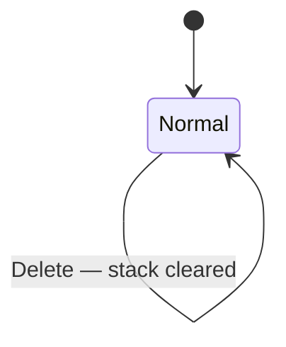

# UseCase: User arranges stack values

## Actor
User (CLI power user)

## Preconditions
- rpnpad is running in normal mode
- Stack has sufficient depth for the chosen operation (≥1 for dup/drop,
  ≥2 for swap, ≥3 for rotate; clear works on any depth including empty)

## Main Flow
1. User presses a single key in normal mode:
   - `s` — swap: exchanges positions 1 and 2
   - `p` — dup: duplicates position 1, pushing a copy onto the stack
   - `Backspace` — drop: discards position 1
   - `R` — rotate: cycles top three down (1→3, 2→1, 3→2)
   - `Delete` — clear: removes all values from the stack (no error if already empty)
2. Stack updates immediately; display reflects new arrangement

## Alternate Flows
- **Enter with empty input buffer (HP convention)**: behaves as dup

## Error Conditions
- **Stack underflow** (e.g. swap with <2 items, rotate with <3): error shown
  on ErrorLine, stack left unchanged

## Postconditions
- Stack reflects the new arrangement
- All values that were not affected remain unchanged and in their prior positions

## Flow

## Acceptance Criteria
**AC-1:** Given the stack has ≥1 item, when the user presses `p`, then position 1 is duplicated at the top of the stack.

**AC-2:** Given the stack has ≥2 items, when the user presses `s`, then positions 1 and 2 are exchanged.

~~**AC-3:** Given the stack has ≥1 item, when the user presses `d`, then position 1 is removed from the stack.~~ *(deprecated — `d` is now Noop; use Backspace)*

**AC-4:** Given the stack has ≥3 items, when the user presses `R`, then the top three items cycle down: position 1 moves to 3, position 2 moves to 1, and position 3 moves to 2.

**AC-5:** Given insufficient stack depth for the chosen operation, when the key is pressed, then an error is shown on the ErrorLine and the stack is unchanged.

**AC-6:** Given the stack has ≥1 item, when the user presses `Backspace` in Normal mode, then position 1 is removed from the stack.

**AC-7:** Given any stack depth (including empty), when the user presses `Delete` in Normal mode, then all stack items are removed and the stack is empty. No error is shown when the stack is already empty.

**AC-8:** Given Normal mode, when the user presses `d`, then no action is taken and no error is shown (`d` is Noop — use Backspace to drop).

## Related
- **Sibling**: [User pushes a numeric value onto the stack](../push-value/usecase.md)
- **Parent intent**: [Stack Management](../../intent.md)

## Implementations <!-- taproot-managed -->
- [Arrange Stack Values](./tui/impl.md)

## Status
- **State:** implemented
- **Created:** 2026-03-21
- **Last reviewed:** 2026-03-26

