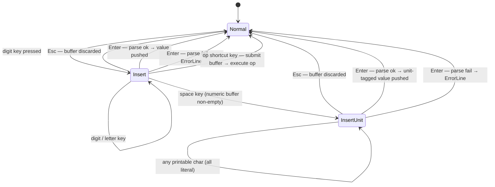

# UseCase: User pushes a numeric value onto the stack

## Actor
User (CLI power user)

## Preconditions
- rpnpad is running with the TUI open

## Main Flow
1. User begins typing a numeric literal — any digit keypress from normal mode
   triggers Insert mode automatically; no explicit mode-switch key required
2. TUI displays the growing input in the InputLine with a blinking cursor
3. User presses Enter to commit
4. The input is parsed into a CalcValue (Integer or Float)
5. The value is pushed onto the stack; stack display updates immediately

## Alternate Flows
- **Hex literal (0x…)**: parsed as integer in hexadecimal base
- **Octal literal (0o…)**: parsed as integer in octal base
- **Binary literal (0b…)**: parsed as integer in binary base
- **Float literal (digits with `.`)**: parsed as arbitrary-precision Float
- **User presses Esc mid-entry**: Insert mode exits, buffer discarded, no push
- **Operation shortcut**: in Insert mode, keys `s` `d` `r` `n` `p` `+` `-` `*`
  `/` `^` `%` `!` act as immediate shortcuts — submit the current buffer then
  execute the operation (e.g. type `3`, press `s` → push 3, swap).
  **Constraint:** the `/` shortcut (and all other op shortcuts) only fire when
  no space has been typed yet (pure numeric context). Once a space is entered,
  the buffer is in unit expression context and `/` is treated as a literal character.

### Unit expression entry
- **Trigger:** User types a space character while in Insert mode with a non-empty
  numeric buffer.
- **Steps:**
  1. Insert mode enters unit expression context — the buffer now accepts a unit expression.
  2. In this context, all operation shortcut keys (`/`, `*`, `+`, `-`, etc.) are
     treated as literal characters, not shortcuts.
  3. User types the unit expression (e.g. `m/s`, `kg*m/s2`).
  4. User presses Enter; the full buffer (e.g. `1 m/s`) is submitted to the parser
     as a unit-tagged value.
  5. If the unit is valid, the tagged value is pushed onto the stack.
  6. If the unit is unrecognised, an error is shown and the stack is unchanged.
- **Note:** Compound units containing `/` (e.g. `m/s`) must use the space separator;
  `1m/s` without a space is not valid for compound units.

## Error Conditions
- **Malformed input (e.g. `1.2.3`)**: error displayed on ErrorLine, stack
  unchanged, mode returns to normal

## Postconditions
- Stack depth increases by 1
- New value is at position 1 (top)
- Display updates to show the value in the current base/representation style
- Stack position labels (`1:` at top, `2:`, `3:`…) are always visible regardless
  of stack depth; empty rows show the label with no value beside it

## Flow

## Acceptance Criteria
**AC-1:** Given rpnpad is in normal mode, when the user presses a digit key, then Insert mode activates and the digit appears in the InputLine.

**AC-2:** Given Insert mode is active with a valid numeric literal, when Enter is pressed, then the value is pushed to the top of the stack and the stack display updates.

**AC-3:** Given Insert mode is active, when Esc is pressed, then the buffer is discarded, mode returns to normal, and the stack is unchanged.

**AC-4:** Given Insert mode is active with malformed input, when Enter is pressed, then an error is shown on the ErrorLine and the stack is unchanged.

**AC-5:** Given Insert mode is active, when an operation shortcut key (e.g. `s`, `+`) is pressed, then the current buffer is submitted and the operation executes immediately.

**AC-6:** Given the stack is empty, when the TUI renders the stack pane, then position labels (`1:`, `2:`, `3:`…) are shown for all visible rows with no value beside them.

**AC-7:** Given Insert mode is active with a non-empty numeric buffer, when the user types a space then `m/s` and presses Enter, then `1 m/s` is pushed onto the stack as a unit-tagged value.

**AC-8:** Given Insert mode is active with buffer `1 m` (space has been typed), when the user presses `/`, then `/` is appended to the buffer as a literal character and no division occurs.

## Related
- **Sibling**: [User arranges stack values](../arrange-stack-values/usecase.md)
- **Alpha mode** (free-text entry via `i` key, no shortcuts): see [named registers](../../state-and-memory/named-registers/usecase.md)
- **Parent intent**: [Stack Management](../../intent.md)

## Implementations <!-- taproot-managed -->
- [Push Value](./tui/impl.md)

## Status
- **State:** implemented
- **Created:** 2026-03-21
- **Last reviewed:** 2026-03-26

