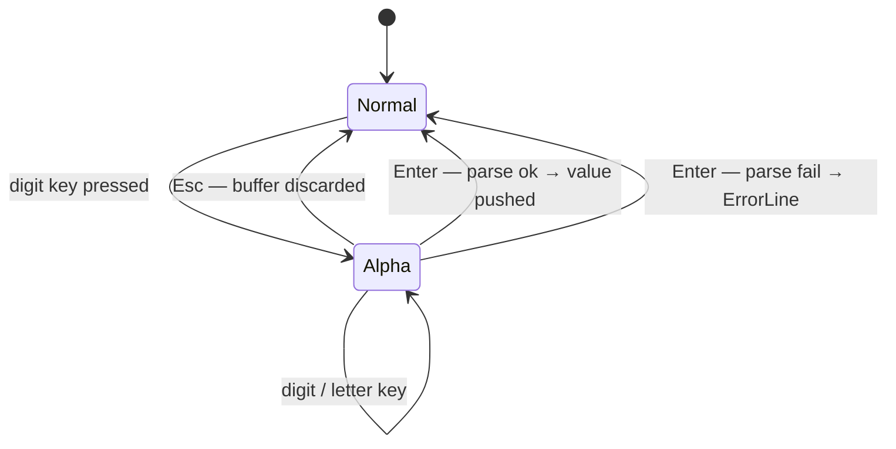

# UseCase: User pushes a numeric value onto the stack

## Actor
User (CLI power user)

## Preconditions
- rpncalc is running with the TUI open

## Main Flow
1. User begins typing a numeric literal — any digit keypress from normal mode
   triggers alpha mode automatically
2. TUI displays the growing input in the InputLine with a blinking cursor
3. User presses Enter to commit
4. The input is parsed into a CalcValue (Integer or Float)
5. The value is pushed onto the stack; stack display updates immediately

## Alternate Flows
- **Hex literal (0x…)**: parsed as integer in hexadecimal base
- **Octal literal (0o…)**: parsed as integer in octal base
- **Binary literal (0b…)**: parsed as integer in binary base
- **Float literal (digits with `.`)**: parsed as arbitrary-precision Float
- **User presses Esc mid-entry**: alpha mode exits, buffer discarded, no push

## Error Conditions
- **Malformed input (e.g. `1.2.3`)**: error displayed on ErrorLine, stack
  unchanged, mode returns to normal

## Postconditions
- Stack depth increases by 1
- New value is at the top (X position)
- Display updates to show the value in the current base/representation style

## Flow

## Acceptance Criteria
**AC-1:** Given rpncalc is in normal mode, when the user presses a digit key, then alpha mode activates and the digit appears in the InputLine.

**AC-2:** Given alpha mode is active with a valid numeric literal, when Enter is pressed, then the value is pushed to the top of the stack and the stack display updates.

**AC-3:** Given alpha mode is active, when Esc is pressed, then the buffer is discarded, mode returns to normal, and the stack is unchanged.

**AC-4:** Given alpha mode is active with malformed input, when Enter is pressed, then an error is shown on the ErrorLine and the stack is unchanged.

## Related
- **Sibling**: [User arranges stack values](../arrange-stack-values/usecase.md)
- **Parent intent**: [Stack Management](../../intent.md)

## Implementations <!-- taproot-managed -->
- [Push Value](./tui/impl.md)

## Status
- **State:** specified
- **Created:** 2026-03-21
- **Last reviewed:** 2026-03-24
