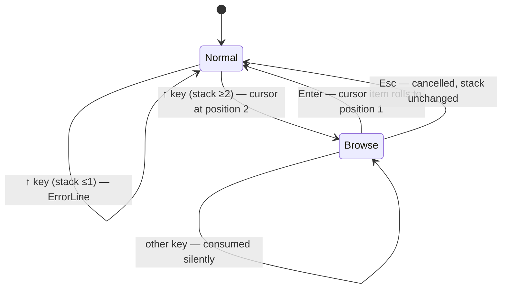

# Behaviour: User rolls a deep stack value to the top

## Actor
User (CLI power user)

## Preconditions
- rpnpad is running in normal mode
- Stack has ≥2 items (single-item stack has nothing to roll)

## Main Flow
1. User presses `↑` (up arrow) in normal mode
2. TUI enters Browse mode; a cursor highlights position 2 (first item
   above the top)
3. User presses `↑` to move cursor deeper into the stack (position 3,
   4…), `↓` to move back toward the top (minimum position 2), or
   Enter at any point — including immediately, without moving the
   cursor
4. User presses Enter to confirm
5. The item at the cursor position moves to position 1; all items that
   were between it and position 1 each shift one position deeper (their
   position numbers increase by 1)
6. Browse mode exits; stack display updates immediately

## Alternate Flows
### Cancel mid-navigation
- **Trigger:** User presses Esc while in Browse mode
- **Steps:**
  1. Browse mode exits
  2. Stack is unchanged
- **Outcome:** Normal mode resumed; no mutation

### Cursor at deepest visible position
- **Trigger:** User presses `↑` when cursor is already at the deepest
  visible stack row
- **Steps:**
  1. Cursor stays in place (clamp, no wrap)
- **Outcome:** Visual cursor unchanged; Browse mode stays active
- **Note:** Items scrolled off the top of the stack pane are beyond
  the visible window and are not reachable by the cursor. Browse mode
  only navigates visible rows; no scroll occurs.

### Cursor at position 2, user presses `↓`
- **Trigger:** User presses `↓` when cursor is already at position 2
- **Steps:**
  1. Cursor stays at position 2 (clamp; rolling position 1 to itself
     is a no-op and would be confusing)
- **Outcome:** Visual cursor unchanged; Browse mode stays active

### Unrecognized keypress in Browse mode
- **Trigger:** User presses any key other than `↑`, `↓`, Enter, or Esc
  while in Browse mode
- **Steps:**
  1. The keypress is silently consumed
  2. Browse mode remains active; cursor position unchanged
- **Outcome:** No side-effect; user must use Enter or Esc to exit

## Postconditions
- The value that was at cursor position N is now at position 1
- The values that were at positions 1 through N−1 are now at positions
  2 through N (shifted one deeper each)
- All values deeper than N are unchanged
- Stack depth is unchanged
- The roll is recorded on the undo stack and is reversible with undo

## Error Conditions
- **`↑` pressed with ≤1 item**: error on ErrorLine ("stack underflow:
  roll requires at least 2 items"), Browse mode not entered, stack
  unchanged

## Flow

## Related
- `../arrange-stack-values/usecase.md` — sibling; covers fixed-depth
  single-key operations (swap, dup, drop, rotate top 3); roll-to-top
  is the arbitrary-depth complement for reaching deeper stack items
- `../push-value/usecase.md` — sibling; shares actor and stack as the
  shared input medium
- `../../state-and-memory/undo-redo/usecase.md` — roll is undo-able;
  this behaviour depends on the undo stack being updated on confirmation

## Acceptance Criteria

**AC-1: Roll item from depth N to position 1**
- Given the stack has ≥2 items and Browse mode is active with cursor at position N (N ≥ 2)
- When the user presses Enter
- Then the item formerly at position N is now at position 1, items formerly at positions 1 through N−1 are at positions 2 through N, and all other values are unchanged

**AC-2: Cancel with Esc preserves stack**
- Given Browse mode is active with cursor at any position
- When the user presses Esc
- Then Browse mode exits, the stack is unchanged, and normal mode resumes

**AC-3: Up-arrow navigates cursor deeper**
- Given Browse mode is active with cursor at position N and N is not the deepest visible position
- When the user presses `↑`
- Then the cursor moves to position N+1

**AC-4: Down-arrow navigates cursor toward top**
- Given Browse mode is active with cursor at position N (N ≥ 3)
- When the user presses `↓`
- Then the cursor moves to position N−1

**AC-5: Cursor clamped at deepest visible position**
- Given Browse mode is active with cursor at the deepest visible position
- When the user presses `↑`
- Then the cursor stays at the deepest visible position and Browse mode remains active

**AC-6: Cursor clamped at position 2**
- Given Browse mode is active with cursor at position 2
- When the user presses `↓`
- Then the cursor stays at position 2 and Browse mode remains active

**AC-7: Error when stack has ≤1 item**
- Given the stack has 0 or 1 items and rpnpad is in normal mode
- When the user presses `↑`
- Then an error is shown on the ErrorLine, Browse mode is not entered, and the stack is unchanged

**AC-8: Mode bar shows [BROWSE] in browse mode**
- Given Browse mode is active
- When the TUI renders
- Then the mode bar displays `[BROWSE]`

**AC-9: Hints pane shows browse-mode controls**
- Given Browse mode is active
- When the TUI renders
- Then the hints pane shows: Enter (roll to top), Esc (cancel), ↑/↓ (navigate)

**AC-10: Cursor row is visually distinct in stack pane**
- Given Browse mode is active with cursor at position N
- When the TUI renders the stack pane
- Then the row at position N is rendered with a visual distinction (e.g. inverted colors or highlighted background) that makes it clearly identifiable as the cursor position

**AC-11: Unrecognized keys in Browse mode are ignored**
- Given Browse mode is active
- When the user presses a key that is not `↑`, `↓`, Enter, or Esc
- Then Browse mode remains active, the cursor position is unchanged, and no stack mutation occurs

**AC-12: Roll is undo-able**
- Given a roll has been performed (Browse mode confirmed with Enter)
- When the user presses `u` (undo)
- Then the stack reverts to its state immediately before the roll

## Notes
- **ROLL(2) = swap**: When the cursor is at position 2 (including
  entering Browse mode and pressing Enter immediately), the roll is
  equivalent to pressing `s` (swap). Both are valid — Browse mode is
  the discoverable path, `s` is the expert shortcut.
- **Visible-window limit**: Browse mode does not scroll the stack pane.
  Items beyond the visible rows are not reachable. On deep stacks,
  the user must rely on rotate (`R`) sequences or undo/redo to expose
  deeply buried items.

## Implementations <!-- taproot-managed -->
- [Roll to Top TUI](./tui/impl.md)

## Status
- **State:** implemented
- **Created:** 2026-03-24
- **Last reviewed:** 2026-03-24
