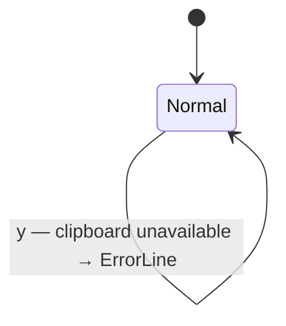

# UseCase: User copies the top stack value to the system clipboard

## Actor
User (CLI power user)

## Preconditions
- rpncalc is running in normal mode
- Stack has ≥1 value
- System clipboard is accessible (arboard)

## Main Flow
1. User presses `y` (yank) in normal mode
2. The position-1 value is formatted in the current base and representation style
   (e.g. `0xFF` in HEX/ZeroX style, `42` in DEC)
3. The formatted string is written to the system clipboard
4. No stack mutation — position 1 remains on the stack

## Error Conditions
- **Empty stack**: error on ErrorLine, nothing copied
- **Clipboard unavailable** (no display server, permission denied): error
  on ErrorLine, stack unchanged

## Postconditions
- System clipboard contains the formatted position-1 value
- Stack is unchanged

## Flow

## Acceptance Criteria
**AC-1:** Given the stack has ≥1 item and the clipboard is accessible, when the user presses `y`, then the position-1 value formatted in the current base/style is written to the system clipboard and the stack is unchanged.

**AC-2:** Given the stack is empty, when `y` is pressed, then an error is shown on the ErrorLine and nothing is copied.

**AC-3:** Given the clipboard is unavailable (e.g. no display server), when `y` is pressed, then an error is shown on the ErrorLine and the stack is unchanged.

## Related
- **Sibling**: [User stores and recalls values in named registers](../named-registers/usecase.md)
- **Sibling**: [User undoes or redoes a state-mutating operation](../undo-redo/usecase.md)
- **Parent intent**: [State and Memory](../../intent.md)

## Implementations <!-- taproot-managed -->
- [Clipboard Copy](./tui/impl.md)

## Status
- **State:** specified
- **Created:** 2026-03-21
- **Last reviewed:** 2026-03-24
