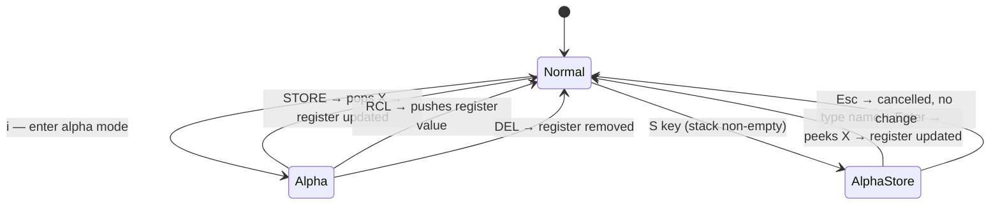

# UseCase: User stores and recalls values in named registers

## Actor
User (CLI power user)

## Preconditions
- rpncalc is running in normal mode
- For STORE: stack has ≥1 value
- For RCL/DELETE: the named register exists

## Main Flow
1. User types a register name in alpha mode, followed by `STORE` or `RCL`
   (e.g. `r1 STORE`, `r1 RCL`)
2. **STORE**: pops X from the stack and writes it into the named register
3. **RCL**: pushes the register's value onto the stack (register preserved)
4. Hints pane register section updates to reflect current register state

## Alternate Flows
- **Quick-store (`S` key)**: from normal mode, user presses `S`, types the
  register name, presses Enter — X is stored to the register *without being
  removed from the stack* (peek semantics); mode returns to normal
- **View registers**: all defined register names and values are visible in
  the hints pane register section at all times (when registers exist)
- **DELETE**: user types `<name> DEL` — removes the named register entirely
- **Overwrite**: storing to an existing register name silently replaces the
  prior value

## Error Conditions
- **STORE on empty stack**: error on ErrorLine, register unchanged
- **RCL of undefined register**: error on ErrorLine, stack unchanged
- **DELETE of undefined register**: error on ErrorLine, no change

## Postconditions
- Register state updated in CalcState
- Operation is undo-able — undo restores prior register state

## Flow

## Acceptance Criteria
**AC-1:** Given the stack has ≥1 item, when the user submits `<name> STORE` in alpha mode, then X is popped from the stack and stored under the given name.

**AC-2:** Given a named register exists, when the user submits `<name> RCL` in alpha mode, then the register's value is pushed onto the stack and the register is preserved.

**AC-3:** Given the stack has ≥1 item, when the user presses `S`, types a name, and presses Enter, then X is stored to the register without being removed from the stack.

**AC-4:** Given a named register exists, when the user submits `<name> DEL` in alpha mode, then the register is removed.

**AC-5:** Given STORE/RCL/DEL targets an invalid state (empty stack or undefined register), when the command is submitted, then an error is shown on the ErrorLine and the state is unchanged.

## Related
- **Sibling**: [User undoes or redoes a state-mutating operation](../undo-redo/usecase.md)
- **Sibling**: [Session state persists across process restarts](../session-persistence/usecase.md)
- **Parent intent**: [State and Memory](../../intent.md)

## Implementations <!-- taproot-managed -->
- [Named Registers](./tui/impl.md)

## Status
- **State:** specified
- **Created:** 2026-03-21
- **Last reviewed:** 2026-03-24
