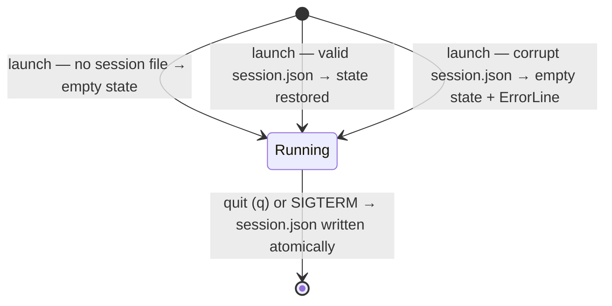

# UseCase: Session state persists across process restarts

## Actor
User (CLI power user)

## Preconditions
- `persist_session = true` in config (default)
- `~/.rpnpad/` directory is writable

## Main Flow
1. User quits rpnpad (`q`) or the process receives SIGTERM
2. Current CalcState (stack + registers) is written atomically to
   `~/.rpnpad/session.json` via write-to-temp → rename
3. On next launch: config is loaded, then session.json is read and
   CalcState is restored before the first frame renders

## Alternate Flows
- **`persist_session = false`**: session is not saved on exit; rpnpad
  always starts with an empty stack and no registers
- **SIGTERM**: signal-hook handler triggers the same save path as clean exit
- **RESET command**: user types `RESET` in alpha mode and presses Enter —
  CalcState is cleared (stack and registers emptied) and the empty state is
  saved to session.json immediately; takes effect in the running session.
  RESET is snapshotted by the undo mechanism — the pre-reset state can be
  restored with Undo.

## Error Conditions
- **Write failure** (disk full, permissions): prior session.json left intact
  via atomic write — no corrupt partial state
- **Corrupt session.json on load**: file is ignored; rpnpad starts with
  empty state and an informative error is shown on the ErrorLine
- **SIGKILL**: no save possible — explicitly out of scope

## Postconditions
- On save: session.json reflects the final CalcState at exit time
- On restore: stack and registers are identical to the last saved state

## Flow

## Acceptance Criteria
**AC-1:** Given `persist_session = true` and the user quits with `q`, then the current CalcState is written atomically to `~/.rpnpad/session.json`.

**AC-2:** Given a valid `session.json` exists on launch, then the prior stack and registers are restored before the first frame renders.

**AC-3:** Given `session.json` is corrupt on launch, then rpnpad starts with empty state and an informative error is shown on the ErrorLine.

**AC-4:** Given `persist_session = false`, then session.json is not read on launch and not written on exit.

**AC-5:** Given rpnpad is running, when the user types `RESET` in alpha mode and presses Enter, then CalcState is cleared and the empty state is written to session.json immediately. The pre-reset state is preserved in the undo stack and can be restored with Undo.

## Related
- **Sibling**: [User undoes or redoes a state-mutating operation](../undo-redo/usecase.md)
- **Sibling**: [User stores and recalls values in named registers](../named-registers/usecase.md)
- **Configured by**: [User configures rpnpad defaults via config.toml](../../configuration/configure-defaults/usecase.md)
- **Parent intent**: [State and Memory](../../intent.md)

## Implementations <!-- taproot-managed -->
- [Session Persistence](./tui/impl.md)

## Status
- **State:** implemented
- **Created:** 2026-03-21
- **Last reviewed:** 2026-03-27
