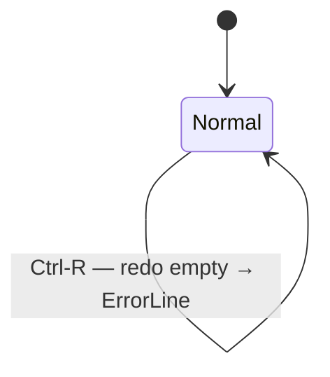

# UseCase: User undoes or redoes a state-mutating operation

## Actor
User (CLI power user)

## Preconditions
- rpncalc is running in normal mode
- For undo: at least one state-mutating operation has been performed this session
- For redo: at least one undo has been performed since the last new operation

## Main Flow
1. User presses `u` to undo (or `Ctrl-R` to redo)
2. The full CalcState snapshot (stack + registers + modes) is restored from
   the undo/redo stack
3. Stack display, ModeBar, and hints pane all update to reflect the restored state

## Alternate Flows
- **Multiple undos**: user presses `u` repeatedly, stepping back through
  history one snapshot at a time
- **Redo after undo**: `Ctrl-R` re-applies the undone operation

## Error Conditions
- **Nothing to undo**: undo stack is empty — error shown on ErrorLine,
  state unchanged
- **Nothing to redo**: redo stack is empty — error shown on ErrorLine,
  state unchanged
- **New operation clears redo stack**: any state-mutating action after an
  undo discards the redo history

## Postconditions
- CalcState reflects the snapshot at the target history position
- Undo depth is bounded by `max_undo_history` from config

## Flow

## Acceptance Criteria
**AC-1:** Given at least one state-mutating operation has been performed, when the user presses `u`, then the most recent CalcState snapshot is restored and the display updates.

**AC-2:** Given at least one undo has been performed without a subsequent new operation, when the user presses `Ctrl-R`, then the undone state is re-applied.

**AC-3:** Given the undo stack is empty, when `u` is pressed, then an error is shown on the ErrorLine and the state is unchanged.

**AC-4:** Given the redo stack is empty, when `Ctrl-R` is pressed, then an error is shown on the ErrorLine and the state is unchanged.

## Related
- **Sibling**: [User stores and recalls values in named registers](../named-registers/usecase.md)
- **Sibling**: [Session state persists across process restarts](../session-persistence/usecase.md)
- **Parent intent**: [State and Memory](../../intent.md)

## Implementations <!-- taproot-managed -->
- [Undo / Redo](./tui/impl.md)

## Status
- **State:** specified
- **Created:** 2026-03-21
- **Last reviewed:** 2026-03-24
